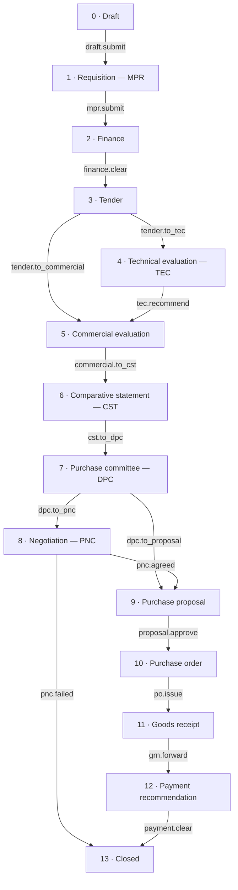
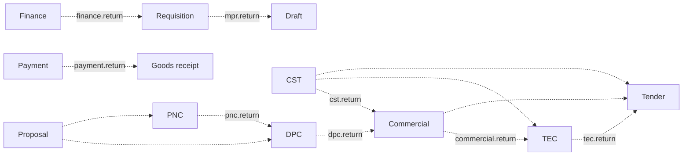

# Procurement

The procurement portal is a second product inside the same application. It carries a purchase from the moment somebody asks for something to the moment the invoice is cleared, through fourteen stages and sixteen roles, with every movement recorded.

It is reached from its own door on the landing page — not from the document workspace header — and it has its own sign-in, its own shell, and its own navigation. A person who only does procurement never sees the document workspace, and vice versa.

- **Branch:** `feat/procurement`
- **Backend:** Postgres in the existing self-hosted Supabase stack. No new service.
- **Migrations:** `supabase/migrations/20260903120000_procurement_foundation.sql` and the four slices after it.
- **Front end:** `src/features/procurement/` and `src/pages/procurement/`.

---

## 1. What is built, and what is not

**Built (the foundation slice).**

- The full fourteen-stage lifecycle as data, not code: stages, their order, their entry statuses, their timers, the legal moves between them, and every stage action, all stored as rows.
- The stage engine: one database function that validates a decision, moves the case, and writes the trail.
- Sixteen roles, twenty-five permissions, and the role-to-permission matrix.
- Row-level security on every table, with a single visibility predicate the whole schema shares.
- The portal: sign-in, a role-specific dashboard, queues, a register of all cases, a "waiting on you" worklist, the case file with a stage index, an action bar, a clarification thread, an audit trail, and case documents that ride the existing document ingest pipeline.
- Demo accounts, one per role, seeded automatically.

**Not built yet (later slices of the plan).**

- The working detail of each stage: bill-of-quantities lines, budget heads and commitments, tenders and bids, technical evaluation grids, quotations and the comparative statement, committee meetings and votes, negotiation rounds, proposals, purchase orders, goods receipt notes, payment recommendations. The stages exist and a case moves through all of them; what each stage currently shows is a summary panel rather than its own working form.
- `/procurement/admin` and `/procurement/insights`.
- Digital signature capture. Actions that should carry a signature are flagged `requires_signature` in the data, and the flag is recorded, but nothing enforces it yet.
- Stage guards. `procurement_stage_actions.guard_function` exists and the engine calls it when it is set; no guard is set yet.
- SLA escalation. `sla_hours` and `escalation_role` are stored per stage but nothing acts on them.

---

## 2. Getting in

| Where | What it is |
|---|---|
| `/` → the "procurement portal" band | The entry point on the landing page. Explains the ten-step chain and offers the door. |
| `/procurement/sign-in` | The portal's own sign-in. Public. Somebody already signed in is offered the portal rather than asked for a password again, and is told plainly if they hold no procurement desk. |
| `/procurement` | The portal dashboard, shaped by the role signed in. |
| `/procurement/register` | Every case the person is allowed to see, filterable. |
| `/procurement/inbox` | "Waiting on you" — open cases sitting at a stage this person can act on, oldest first. |
| `/procurement/queue/:queueKey` | One desk's queue. Twelve queue keys, listed in §5.4. |
| `/procurement/new` | Raise a requisition. Needs `mpr.create`. |
| `/procurement/case/:caseNo` | The case file. |

Every route except the sign-in is wrapped in `RequirePermission`, which sends an unauthenticated visitor to `/procurement/sign-in` rather than to `/auth`.

After sign-in, a person holding exactly one role lands on that role's queue; anybody holding several roles, or the administrator, lands on `/procurement`. The mapping lives in `portalHome()` in `src/features/procurement/lib/portals.ts`.

---

## 3. The lifecycle

### 3.1 The chain



### 3.2 The way back

Backward moves are not free. A case may only return along a path that exists as a row in `procurement_return_paths`, and only through an action that declares that target. There are thirteen such paths:



Some of these paths are declared in the data but have no action wired to them yet — `cst → tec`, `cst → tender`, `purchase_proposal → dpc`, `purchase_proposal → pnc`, `mpr → draft`. They are legal moves that a later slice will offer a button for; today only the paths with an action code above can be taken through the portal.

Forward jumps of any distance are always allowed. `→ closed` is always allowed. Staying at the same stage is allowed, which is how a clarification works.

### 3.3 Rejection

Rejection is terminal and possible from six stages: finance, TEC, commercial, DPC, purchase proposal, and payment. It is not an ordinary transition. `procurement_reject_case()` parks the case back at the requisition stage with the status `Rejected`, sets `case_status = 'rejected'`, and writes who rejected it, when, at which stage, and why into `procurement_cases.rejection` as JSON. A rejected case is `open = false`, so no queue and no worklist picks it up again, but the requester can still open it and read the reason.

---

## 4. Stage by stage

Fourteen stages, from `procurement_stage_config`. "Timer" is the SLA in hours; nothing enforces it yet.

| # | Stage | Label | Status on arrival | Timer | Escalates to | Required |
|---|---|---|---|---|---|---|
| 0 | `draft` | Draft | Draft | — | — | yes |
| 1 | `mpr` | Requisition | Requisition raised | 72 h | Purchase head | yes |
| 2 | `finance` | Finance | Awaiting finance clearance | 72 h | Purchase head | yes |
| 3 | `tender` | Tender | Tender in preparation | 168 h | Purchase head | yes |
| 4 | `tec` | Technical evaluation | Technical evaluation underway | 120 h | TEC chairperson | yes |
| 5 | `commercial` | Commercial evaluation | Commercial evaluation underway | 120 h | Head of division | yes |
| 6 | `cst` | Comparative statement | Comparative statement under scrutiny | 72 h | Head of division | yes |
| 7 | `dpc` | Purchase committee | Before the purchase committee | 168 h | DPC chairman | yes |
| 8 | `pnc` | Negotiation | In negotiation | 168 h | PNC chairman | **optional** |
| 9 | `purchase_proposal` | Purchase proposal | Proposal under review | 120 h | Approving authority | yes |
| 10 | `purchase_order` | Purchase order | Purchase order in preparation | 72 h | PO officer | yes |
| 11 | `goods_receipt` | Goods receipt | Awaiting delivery | — | Stores and accounts | yes |
| 12 | `payment_recommendation` | Payment | Payment being processed | 120 h | Stores and accounts | yes |
| 13 | `closed` | Closed | Closed | — | — | yes |

### 4.1 Every action

All thirty-five moves, from `procurement_stage_actions`. "Remarks" means the engine refuses the action without them. "Sign" is the `requires_signature` flag — recorded, not yet enforced. "Chair" means only the chairperson of that stage's committee (or the procurement administrator) may take it.

| Code | At stage | Button | Permission | Moves to | Remarks | Sign | Chair |
|---|---|---|---|---|---|---|---|
| `draft.submit` | draft | Raise requisition | `mpr.create` | mpr | | | |
| `mpr.submit` | mpr | Send for finance clearance | `mpr.create` | finance | | | |
| `finance.clear` | finance | Clear the budget | `finance.approve` | tender | ✓ | ✓ | |
| `finance.query` | finance | Ask the requester a question | `finance.approve` | — (holds) | ✓ | | |
| `finance.return` | finance | Return to the requester | `finance.reject` | mpr | ✓ | | |
| `finance.refuse` | finance | Refuse the budget | `finance.reject` | rejected | ✓ | ✓ | |
| `tender.to_tec` | tender | Hand off for technical evaluation | `tender.create` | tec | | | |
| `tender.to_commercial` | tender | Open commercially without evaluation | `tender.create` | commercial | ✓ | | |
| `tec.recommend` | tec | Recommend for commercial evaluation | `tec.chair` | commercial | ✓ | ✓ | ✓ |
| `tec.query` | tec | Seek clarification from a bidder | `tec.chair` | — (holds) | ✓ | | ✓ |
| `tec.return` | tec | Return to the tender desk | `tec.chair` | tender | ✓ | | ✓ |
| `tec.refuse` | tec | Reject all bids on technical grounds | `tec.chair` | rejected | ✓ | ✓ | ✓ |
| `commercial.to_cst` | commercial | Draw up the comparative statement | `commercial.evaluate` | cst | | | |
| `commercial.query` | commercial | Seek a commercial clarification | `commercial.evaluate` | — (holds) | ✓ | | |
| `commercial.return` | commercial | Return to technical evaluation | `commercial.evaluate` | tec | ✓ | | |
| `commercial.refuse` | commercial | Reject all bids | `commercial.evaluate` | rejected | ✓ | ✓ | |
| `cst.to_dpc` | cst | Place before the purchase committee | `commercial.evaluate` | dpc | | | |
| `cst.return` | cst | Reopen commercial evaluation | `commercial.evaluate` | commercial | ✓ | | |
| `dpc.to_pnc` | dpc | Refer for price negotiation | `dpc.chair` | pnc | ✓ | | ✓ |
| `dpc.to_proposal` | dpc | Approve and raise a purchase proposal | `dpc.chair` | purchase_proposal | ✓ | ✓ | ✓ |
| `dpc.query` | dpc | Seek clarification before deciding | `dpc.chair` | — (holds) | ✓ | | ✓ |
| `dpc.return` | dpc | Return to commercial evaluation | `dpc.chair` | commercial | ✓ | | ✓ |
| `dpc.refuse` | dpc | Reject the procurement | `dpc.reject` | rejected | ✓ | ✓ | ✓ |
| `pnc.agreed` | pnc | Conclude — agreement reached | `pnc.chair` | purchase_proposal | ✓ | ✓ | ✓ |
| `pnc.return` | pnc | Refer back to the purchase committee | `pnc.chair` | dpc | ✓ | | ✓ |
| `pnc.failed` | pnc | Close — negotiation failed | `pnc.chair` | closed | ✓ | ✓ | ✓ |
| `proposal.approve` | purchase_proposal | Approve and raise the purchase order | `proposal.approve` | purchase_order | ✓ | ✓ | |
| `proposal.revise` | purchase_proposal | Return for revision | `proposal.approve` | — (holds) | ✓ | | |
| `proposal.refuse` | purchase_proposal | Reject the proposal | `proposal.approve` | rejected | ✓ | ✓ | |
| `po.issue` | purchase_order | Issue the purchase order | `po.issue` | goods_receipt | | ✓ | |
| `grn.forward` | goods_receipt | Forward for payment | `grn.create` | payment_recommendation | | | |
| `payment.clear` | payment_recommendation | Approve payment and close | `payment.process` | closed | ✓ | ✓ | |
| `payment.hold` | payment_recommendation | Hold the payment | `payment.process` | — (holds) | ✓ | | |
| `payment.return` | payment_recommendation | Return to stores | `payment.process` | goods_receipt | ✓ | | |
| `payment.refuse` | payment_recommendation | Refuse the payment | `payment.process` | rejected | ✓ | ✓ | |

An action with no target stage holds the case where it is and changes its status label — `Awaiting a reply from the requester`, `Awaiting a bidder clarification`, `Payment on hold`, and so on. Actions of kind `send_back` and `request_clarification` also open a thread on the case, so the person it was sent to sees the question, not just a status.

### 4.2 What happens at each stage

**Draft.** The requester opens the case: a title, a department, an estimated value, and a justification. The case gets a reference of the form `PC-2026-0001` from `procurement_next_ref()`. Nobody else is involved yet.

**Requisition (MPR).** The requisition proper — bill of quantities, budget head, supporting documents. The requester submits it to finance. *(The BoQ and budget-head forms arrive with a later slice; today the stage carries the case summary and its attachments.)*

**Finance.** The finance officer decides whether the budget head can carry the purchase. Clearing it requires remarks and is flagged for signature. They may instead ask the requester a question (the case stays at finance), return it for correction (back to the requisition), or refuse it outright (terminal).

**Tender.** The purchase officer prepares the notice inviting tender, invites vendors, records bids, and closes bidding. They then either hand the case to the technical evaluation committee, or — for a purchase that does not warrant technical evaluation — open it commercially straight away, with remarks explaining why.

**Technical evaluation (TEC).** Members judge each bid against the tender's own specification and record findings. Only the chairperson moves the case on, and only with remarks. The chair may recommend qualified bids for commercial evaluation, seek a clarification from a bidder, return the case to the tender desk, or reject all bids on technical grounds.

**Commercial evaluation.** The head of division approves the format for opening commercial bids; the commercial team prices the bids against the bill of quantities and ranks them. The team then draws up the comparative statement, seeks a clarification, returns the case to technical evaluation, or rejects all bids.

**Comparative statement (CST).** The statement is scrutinised and locked before the case is listed for the committee. It can be reopened for correction, which sends the case back to commercial evaluation.

**Purchase committee (DPC).** The committee sits, votes and records a resolution. The chairman then either refers the case for price negotiation, or approves it and sends it for a purchase proposal; both need remarks. The chairman may also hold the case for a clarification, return it to commercial evaluation, or reject the procurement.

**Negotiation (PNC).** The only optional stage. The negotiation committee runs rounds against the committee's mandate. The chairman concludes with an agreement (the case goes to purchase proposal), refers the case back to the purchase committee, or closes it as a failed negotiation.

**Purchase proposal.** The approving authority clears the proposal before an order can be raised against it, returns it for revision, or rejects it.

**Purchase order.** The PO officer raises the order from the approved proposal and issues it to the vendor. Issuing it opens the goods receipt.

**Goods receipt.** Stores records what arrived, what was inspected, and what was accepted, then forwards the accepted quantities to the payment desk.

**Payment recommendation.** Accounts prices the invoice against the accepted quantities, applies any penalty deduction, and recommends payment. Approving the payment closes the case. The desk may also hold the payment, return the case to stores for a receipt correction, or refuse payment.

**Closed.** End of the line. `case_status` becomes `closed` and `closed_at` is stamped.

---

## 5. Roles, permissions and desks

### 5.1 The sixteen roles

| Role | Demo account | Portal title | Step |
|---|---|---|---|
| `proc_admin` | `admin@jyoma.ai` | Administration | all |
| `purchase_head` | `head@jyoma.ai` | Oversight (read-only) | all |
| `requester` | `requester@jyoma.ai` | Requisitions | 1 |
| `finance_user` | `finance@jyoma.ai` | Budget clearance | 2 |
| `purchase_officer` | `tender@jyoma.ai` | Tendering | 3 |
| `tec_chairman` | `tec.chair@jyoma.ai` | Technical evaluation — chair | 4 |
| `tec_member` | `tec.member@jyoma.ai` | Technical evaluation | 4 |
| `head_of_division` | `hod@jyoma.ai` | Divisional approvals | 5 |
| `commercial_team` | `commercial@jyoma.ai` | Commercial evaluation | 5 |
| `dpc_chairman` | `dpc.chair@jyoma.ai` | Purchase committee — chair | 6 |
| `dpc_member` | `dpc.member@jyoma.ai` | Purchase committee | 6 |
| `pnc_chairman` | `pnc.chair@jyoma.ai` | Price negotiation — chair | 7 |
| `pnc_member` | `pnc.member@jyoma.ai` | Price negotiation | 7 |
| `management_approver` | `approver@jyoma.ai` | Approving authority | 8 |
| `po_officer` | `po@jyoma.ai` | Purchase orders | 9 |
| `receipt_payment_officer` | `payments@jyoma.ai` | Stores & accounts | 10 |

### 5.2 The twenty-five permissions

`view_self`, `mpr.create`, `mpr.view`, `oversight.view`, `finance.approve`, `finance.reject`, `tender.create`, `tec.evaluate`, `tec.chair`, `commercial.evaluate`, `commercial.opening.approve`, `dpc.approve`, `dpc.reject`, `dpc.chair`, `pnc.negotiate`, `pnc.chair`, `proposal.draft`, `proposal.approve`, `po.issue`, `grn.create`, `payment.process`, `master_data.manage`, `manage_users`, `upload_docs`, `docs.upload`.

### 5.3 Who holds what

| Role | Permissions |
|---|---|
| `proc_admin` | all twenty-five |
| `purchase_head` | `view_self`, `mpr.view`, `oversight.view` |
| `requester` | `view_self`, `mpr.create`, `mpr.view`, `upload_docs`, `docs.upload` |
| `finance_user` | `view_self`, `mpr.view`, `finance.approve`, `finance.reject` |
| `purchase_officer` | `view_self`, `mpr.view`, `tender.create`, `proposal.draft`, `upload_docs`, `docs.upload` |
| `tec_chairman` | `view_self`, `mpr.view`, `tec.evaluate`, `tec.chair`, `upload_docs`, `docs.upload` |
| `tec_member` | `view_self`, `mpr.view`, `tec.evaluate`, `upload_docs`, `docs.upload` |
| `head_of_division` | `view_self`, `mpr.view`, `commercial.opening.approve` |
| `commercial_team` | `view_self`, `mpr.view`, `commercial.evaluate` |
| `dpc_chairman` | `view_self`, `mpr.view`, `dpc.approve`, `dpc.reject`, `dpc.chair` |
| `dpc_member` | `view_self`, `mpr.view`, `dpc.approve`, `dpc.reject` |
| `pnc_chairman` | `view_self`, `mpr.view`, `pnc.negotiate`, `pnc.chair` |
| `pnc_member` | `view_self`, `mpr.view`, `pnc.negotiate` |
| `management_approver` | `view_self`, `mpr.view`, `proposal.approve` |
| `po_officer` | `view_self`, `mpr.view`, `po.issue` |
| `receipt_payment_officer` | `view_self`, `mpr.view`, `grn.create`, `payment.process`, `upload_docs`, `docs.upload` |

Note that `head_of_division` holds `commercial.opening.approve` but not `commercial.evaluate`, so it can approve bid opening and sign off the statement but cannot move the case on. Only `commercial_team` (and the administrator) can.

### 5.4 The twelve queues

`requisitions` (draft, mpr) · `finance` (finance) · `tender` (tender) · `technical` (tec) · `commercial` (commercial, cst) · `opening` (commercial, cst — for the head of division) · `committee` (dpc) · `negotiation` (pnc) · `proposals` (purchase_proposal) · `orders` (purchase_order) · `receipts` (goods_receipt) · `payments` (payment_recommendation).

Each queue names the permission that opens it, so the navigation only shows the queues a person can actually use. Somebody holding several roles gets the pooled set. A person with more than two queues gets them collapsed into a "Queues" menu rather than a long row of links.

### 5.5 Which desk each role sits at

`procurement_role_stages` records the stage a role owns. This is what case visibility is derived from (§6):

`finance_user` → finance · `purchase_officer` → tender · `tec_chairman`, `tec_member` → tec · `head_of_division`, `commercial_team` → commercial · `dpc_chairman`, `dpc_member` → dpc · `pnc_chairman`, `pnc_member` → pnc · `management_approver` → purchase_proposal · `po_officer` → purchase_order · `receipt_payment_officer` → goods_receipt.

The requester is deliberately absent: they see their own cases, not everybody's.

---

## 6. Who can see a case

One predicate decides, and every case-scoped policy in the schema calls it. A person can see a case when **any** of these is true:

1. They raised it (`requester_id`), or they opened it (`created_by`).
2. They are a platform administrator (`has_role(uid, 'admin')`).
3. They are the procurement administrator (`proc_admin`).
4. They hold `oversight.view` — this is the purchase head's read-everything role.
5. **A role they hold sits at or before the stage the case has reached.** The finance officer sees a case from finance onward; the PO officer sees it from the purchase order onward; nobody sees a case that has not reached their desk yet.
6. They sit on a committee constituted on that case (TEC, DPC or PNC), regardless of stage.

Rule 5 is the one worth remembering: visibility travels forward with the case. A payments officer cannot see a case still at tender. A requester can always see their own, at any stage.

The predicate exists in two shapes that cannot drift apart, because the second is defined in terms of the first:

- `procurement_can_view_case_row(user, case_id, requester_id, created_by, stage)` — takes the row's own columns. This is what the `procurement_cases` SELECT policy uses. It has to take the columns rather than re-read the row, otherwise `INSERT ... RETURNING` fails: the row being inserted is not visible to a sub-select in its own statement, so the policy would evaluate false and refuse every insert that asks for its own row back.
- `procurement_can_view_case(user, case_id)` — the id-taking wrapper, used by the child tables.

---

## 7. The data model

Fifteen tables. The reference tables are what make the workflow data-driven: the legal moves are rows, not a `switch` statement, so changing the workflow is a migration and not a rewrite.

**Reference data** (readable by anyone signed in, writable only by the administrator)

| Table | Holds |
|---|---|
| `procurement_stage_config` | The fourteen stages: sequence, label, entry status, mandatory, SLA hours, escalation role. |
| `procurement_return_paths` | The thirteen legal backward moves. |
| `procurement_permissions` | The twenty-five permission keys and their labels. |
| `procurement_role_permissions` | The role-to-permission matrix, 88 pairs. |
| `procurement_role_stages` | Which desk each role sits at. |
| `procurement_stage_actions` | The thirty-five moves: code, stage, action kind, label, description, permission, target stage, entry status, `requires_remarks`, `requires_signature`, `chair_only`, `guard_function`, sort order. |
| `procurement_lookups` | Departments, categories, cost centres, procurement types, priorities, units, warehouses. |
| `procurement_ref_counters` | Backs `procurement_next_ref()`, which issues `PC-YYYY-NNNN`. |

**The case spine**

| Table | Holds |
|---|---|
| `procurement_cases` | One row per case: `case_no`, title, stage, status label, case status (`open`/`rejected`/`closed`), department, requester, estimated cost, currency, awarded vendor, rejection JSON, `closed_at`. |
| `procurement_case_events` | Append-only audit. Written by the engine, never by the client. |
| `procurement_stage_history` | Every movement: from stage, to stage, status label, remarks, actor, timestamp. |
| `procurement_clarifications` | Threads. `kind` is `question` or `send_back`; threaded through `parent_id`; resolvable. |
| `procurement_case_documents` | What role a document plays in a case. The file itself lives in the existing `public.documents` table and goes through the normal ingest, OCR and embedding pipeline, so a case attachment is searchable like any other document. Twenty-two document types, from "Notice inviting tender" to "Payment recommendation". |
| `procurement_user_roles` | Role grants, in their own table — the same anti-privilege-escalation shape as the app's `user_roles`. |
| `procurement_committees`, `procurement_committee_members` | TEC, DPC and PNC rosters. Members carry `is_chair`, voting rights, attendance, findings, conflict-of-interest and a signature timestamp. |

---

## 8. The engine

### 8.1 What a decision does

Everything goes through `procurement_record_decision(_case_id, _action_code, _remarks, _payload)`. In order:

1. Load the case. Not found → error.
2. Remember the stage it is at now. *(This matters: the update later overwrites it, and an earlier version of this function recorded the destination as the origin because of exactly that.)*
3. Look the action up in `procurement_stage_actions` **by code and by the stage the case is at**. An action that does not belong to this stage is refused — this is what stops a client replaying a stale button.
4. Check the caller holds the action's permission.
5. If the action requires remarks, refuse empty ones.
6. If the action is chair-only, require that the caller chairs that stage's committee — or is the procurement administrator.
7. If the action names a guard function, call it with `(case_id, payload)` and refuse a false answer. *(None are set yet.)*
8. Apply it: a `reject` calls `procurement_reject_case()`; anything with a target stage calls `procurement_advance_stage()`; anything else leaves the case where it is.
9. A `send_back` or a `request_clarification` opens a clarification row addressed from the origin stage to the target.
10. Write the audit event, stamped with the origin stage.

### 8.2 The other functions

| Function | Does |
|---|---|
| `procurement_advance_stage(case, to, status, remarks)` | The only thing that writes `cases.stage`. Locks the row, checks visibility, checks the transition is legal, applies the destination's entry status, closes the case if the destination is `closed`, and writes the stage history. |
| `procurement_transition_allowed(from, to)` | True for `→ closed`, for staying put, for any forward move, and for a declared return path. False otherwise. |
| `procurement_reject_case(case, remarks)` | Terminal rejection. See §3.3. |
| `procurement_available_actions(case)` | What the signed-in person may do on this case right now. Drives the action bar. |
| `procurement_may_take_action(user, case, stage, action)` | Permission plus the chair rule. Shared by the action bar and the worklist so they cannot disagree. |
| `procurement_my_worklist()` | Open cases the caller can see, sitting at a stage where at least one action is available to them, oldest first. |
| `procurement_stage_counts()` | One row per stage: open cases and total value, under the caller's own visibility. Counted in the database rather than in the browser. |
| `has_procurement_role`, `has_procurement_permission`, `procurement_my_permissions` | RBAC helpers. The last is what the front end loads once at sign-in to drive `can()`. |
| `is_procurement_committee_member`, `is_procurement_committee_chair` | Committee membership. |
| `procurement_role_reaches_stage(user, stage)` | Rule 5 of §6. |
| `procurement_next_ref(prefix)` | `PC-2026-0001` and friends. |
| `procurement_log_event(...)` | Writes the audit row. |

All of them are `SECURITY DEFINER` with `SET search_path = public`, following the app's existing convention.

---

## 9. The front end

```
src/components/auth/
  AuthProvider.tsx        session, app roles, procurement roles, permission set, can()
  ProtectedRoute.tsx      ProtectedRoute + RequirePermission

src/features/procurement/
  types.ts
  api/        cases.ts, lookups.ts, documents.ts
  hooks/      useProcurement.ts — react-query keys and hooks
  lib/        portals.ts (roles → desks, queues, the ten-step chain)
              stages.ts (a one-line brief per stage)
              format.ts (₹ with en-IN grouping, lakh/crore short form, dates, ages)
  components/ PortalLayout, StageIndex, StageActionBar, StageBadge,
              CaseRegisterTable, ClarificationThread, CaseDocuments, CaseAudit
  stages/     StageWorkPanel.tsx — the per-stage centre panel

src/pages/procurement/
  ProcurementSignIn, ProcurementHome, ProcurementRegister,
  ProcurementQueue, ProcurementInbox, ProcurementCase, ProcurementNew
```

The case file puts the stage index down the left, the current stage's work panel in the centre, and documents, clarifications and the audit trail alongside. The action bar renders whatever `procurement_available_actions()` returned, and forces a remarks field when the action demands one — but the database is the thing that enforces it, not the form.

---

## 10. Testing

### 10.1 Bring the stack up

```bash
cd jyoma-ai

# 1. Start Supabase (Postgres, GoTrue, PostgREST, Kong, Studio).
docker compose --project-directory docker -f docker/docker-compose.yml up -d

# 2. Apply migrations. Idempotent — safe to re-run.
#    This also seeds the app users and the procurement demo accounts.
npm run migrate

# 3. If the stack was already migrated, seed the procurement accounts alone.
npm run seed:procurement

# 4. Run the app.
npm run dev          # http://localhost:8080
```

### 10.2 The accounts

Every account below uses the password `ChangeMe!2026` (that is `SEED_DEFAULT_PASSWORD` in `docker/.env`; change it before exposing the stack anywhere).

| Sign in as | Role | Lands on |
|---|---|---|
| `admin@jyoma.ai` | `proc_admin` (plus platform `admin`) | `/procurement` — every queue |
| `head@jyoma.ai` | `purchase_head` | `/procurement` — read-only, every case |
| `requester@jyoma.ai` | `requester` | `/procurement` |
| `finance@jyoma.ai` | `finance_user` | `/procurement/queue/finance` |
| `tender@jyoma.ai` | `purchase_officer` | `/procurement/queue/tender` |
| `tec.chair@jyoma.ai` | `tec_chairman` | `/procurement/queue/technical` |
| `tec.member@jyoma.ai` | `tec_member` | `/procurement/queue/technical` |
| `hod@jyoma.ai` | `head_of_division` | `/procurement/queue/opening` |
| `commercial@jyoma.ai` | `commercial_team` | `/procurement/queue/commercial` |
| `dpc.chair@jyoma.ai` | `dpc_chairman` | `/procurement/queue/committee` |
| `dpc.member@jyoma.ai` | `dpc_member` | `/procurement/queue/committee` |
| `pnc.chair@jyoma.ai` | `pnc_chairman` | `/procurement/queue/negotiation` |
| `pnc.member@jyoma.ai` | `pnc_member` | `/procurement/queue/negotiation` |
| `approver@jyoma.ai` | `management_approver` | `/procurement/queue/proposals` |
| `po@jyoma.ai` | `po_officer` | `/procurement/queue/orders` |
| `payments@jyoma.ai` | `receipt_payment_officer` | `/procurement/queue/receipts` |

The three original app accounts (`admin@`, `moderator@`, `user@`) still work for the document workspace and are unchanged. `moderator@` and `user@` hold no procurement role, which makes them the right accounts for testing that the portal turns somebody away politely.

### 10.3 Automated checks

Two scripts, both non-destructive — the SQL one runs inside a transaction it rolls back.

```bash
npm run check:procurement       # SQL-level: policies and the engine, via psql
npm run check:procurement:api   # REST-level: real sign-ins through Kong/PostgREST
```

`check:procurement` impersonates users by setting `request.jwt.claims`, opens a probe case, and asserts the visibility and transition rules hold. `check:procurement:api` signs in as the seeded users for real and walks a case from draft to tender, asserting along the way that:

- the requester can open a case and raise it, and it reaches finance with the status `Awaiting finance clearance`;
- an action the caller has no permission for is refused by the database;
- the case appears in the right person's worklist;
- the payments desk cannot see a case still at tender;
- a finance send-back returns the case to the requisition **and** opens a `send_back` clarification;
- after clearance the case is at tender;
- the purchase head can see the case but has no actions available on it.

Both should end with every assertion passing and a non-zero exit only on failure.

### 10.4 Before the committee stages: constitute the committees

Chair-only actions (`tec.recommend`, `dpc.to_pnc`, `dpc.to_proposal`, `pnc.agreed`, and their siblings) require the caller to be the **chairperson of a committee constituted on that specific case**. The seed does not constitute committees, because committees belong to a case, not to the system. The screens that constitute them arrive with a later slice.

So you have two ways to test the committee stages:

**Either** drive them as `admin@jyoma.ai`, who holds `proc_admin` and bypasses the chair check.

**Or** constitute the three committees on your test case first. Run this once, with your case number substituted:

```sql
-- psql -h localhost -p 54322 -U postgres -d postgres
DO $$
DECLARE
  _case UUID;
  _kind procurement_committee_kind;
  _committee UUID;
  _chair UUID;
  _member UUID;
BEGIN
  SELECT id INTO _case FROM public.procurement_cases WHERE case_no = 'PC-2026-0001';

  FOREACH _kind IN ARRAY ARRAY['tec','dpc','pnc']::procurement_committee_kind[] LOOP
    INSERT INTO public.procurement_committees (case_id, kind, name)
    VALUES (_case, _kind, upper(_kind::text) || ' for ' || 'PC-2026-0001')
    ON CONFLICT (case_id, kind, cycle) DO NOTHING;

    SELECT id INTO _committee FROM public.procurement_committees
     WHERE case_id = _case AND kind = _kind AND cycle = 1;

    SELECT id INTO _chair  FROM auth.users WHERE email = _kind::text || '.chair@jyoma.ai';
    SELECT id INTO _member FROM auth.users WHERE email = _kind::text || '.member@jyoma.ai';

    INSERT INTO public.procurement_committee_members (committee_id, user_id, is_chair, designation)
    VALUES (_committee, _chair, true, 'Chairperson')
    ON CONFLICT (committee_id, user_id) DO UPDATE SET is_chair = true;

    IF _member IS NOT NULL THEN
      INSERT INTO public.procurement_committee_members (committee_id, user_id, is_chair, designation)
      VALUES (_committee, _member, false, 'Member')
      ON CONFLICT (committee_id, user_id) DO NOTHING;
    END IF;
  END LOOP;
END $$;
```

The `tec.chair@` / `dpc.chair@` / `pnc.chair@` email pattern is what makes the loop work. Once the rows exist, the chair's action bar shows the chair-only buttons and the case appears in their worklist.

### 10.5 The walkthrough

Sign out between steps — the fastest way is a private window per role, or the sign-out in the portal header. Every step says who signs in, what to do, and what should happen.

---

**Step 0 — the door.**
Open `http://localhost:8080/`, scroll to the *procurement portal* band, and press **Enter the procurement portal**. You should land on `/procurement/sign-in`, a page that explains the ten-step chain before asking for a password. Confirm the document workspace header carries no procurement link — the portal is deliberately a separate entrance.

**Step 0b — somebody with no desk.**
Sign in as `user@jyoma.ai`. Expect: signed in successfully, but told plainly that the account holds no procurement desk, and not dropped into a broken dashboard.

---

**Step 1 — raise the requisition.** *(`requester@jyoma.ai`)*

Go to **Raise a requisition** (`/procurement/new`). Fill in:

- Title: `Spectrum analyser, 26.5 GHz, for the RF laboratory` (six characters minimum, or the form objects)
- Department: `Electronics & Instrumentation`
- Estimated value: `4850000`
- Justification: anything

Submit. Expect: you land on the case file at `/procurement/case/PC-2026-0001`; stage **Draft**, status `Draft`; the audit trail has the case opening; the stage index shows draft highlighted and thirteen stages ahead of it.

Press **Raise requisition** in the action bar. Expect: stage **Requisition**, status `Requisition raised`.

Press **Send for finance clearance**. Expect: stage **Finance**, status `Awaiting finance clearance`; the case leaves your worklist; the audit trail now has three entries.

*Optionally*, attach a document from the case file first, and confirm it appears under the case documents with its type and that it also shows up in the normal document workspace — case attachments ride the same ingest pipeline.

---

**Step 2 — the budget decision.** *(`finance@jyoma.ai`)*

You land on `/procurement/queue/finance`. Expect the case to be there, and to be in **Waiting on you**.

First test the send-back. Press **Return to the requester**, remarks `Cost estimate is missing the annual maintenance component.` Expect: stage back to **Requisition**, status `Returned for correction`; a `send_back` thread on the case carrying your remarks.

Sign in as `requester@jyoma.ai` again, read the thread, press **Send for finance clearance**. The case is back at finance.

Back as `finance@jyoma.ai`, press **Clear the budget** with remarks `Head EI-CAP-2026 has the headroom; cleared.` (remarks are compulsory here — try it empty first and confirm the database refuses it). Expect: stage **Tender**, status `Tender in preparation`.

---

**Step 3 — the tender.** *(`tender@jyoma.ai`)*

Landing queue `/procurement/queue/tender`, case present. Press **Hand off for technical evaluation**. Expect: stage **Technical evaluation**, status `Technical evaluation underway`.

*(The alternative route, **Open commercially without evaluation**, needs remarks and skips straight to commercial. Worth testing on a second case.)*

---

**Step 4 — technical evaluation.** *(`tec.member@jyoma.ai`, then `tec.chair@jyoma.ai`)*

As `tec.member@`: the case is visible in `/procurement/queue/technical`, and the action bar shows **no** move-the-case buttons. That is correct — members record findings, the chair decides.

As `tec.chair@`: with the committee constituted (§10.4) the chair-only buttons appear. Press **Recommend for commercial evaluation** with remarks `Two bids meet the specification; the third fails the frequency range.` Expect: stage **Commercial evaluation**, status `Commercial evaluation underway`.

Without a committee, the button is absent and calling the action directly is refused with `Only the chairperson can take this decision`. That is the check working, not a bug.

---

**Step 5 — commercial evaluation.** *(`hod@jyoma.ai`, then `commercial@jyoma.ai`)*

As `hod@`: the case is in `/procurement/queue/opening`. The head of division holds `commercial.opening.approve` and not `commercial.evaluate`, so there is nothing here to move the case with. Correct.

As `commercial@`: press **Draw up the comparative statement**. Expect: stage **Comparative statement**, status `Comparative statement under scrutiny`.

Then press **Place before the purchase committee**. Expect: stage **Purchase committee**, status `Before the purchase committee`.

*(Worth testing on the way: **Reopen commercial evaluation** from CST, which returns the case to commercial with remarks.)*

---

**Step 6 — the purchase committee.** *(`dpc.member@jyoma.ai`, then `dpc.chair@jyoma.ai`)*

As `dpc.member@`: the case is visible in `/procurement/queue/committee`; no chair-only buttons.

As `dpc.chair@`: press **Refer for price negotiation** with remarks `L1 is 8% above the estimate; refer for negotiation.` Expect: stage **Negotiation**, status `In negotiation`.

*(The other route, **Approve and raise a purchase proposal**, skips negotiation entirely — negotiation is the one optional stage.)*

---

**Step 7 — negotiation.** *(`pnc.chair@jyoma.ai`)*

Press **Conclude — agreement reached** with remarks `Vendor agreed to ₹46,20,000 with 24-month warranty.` Expect: stage **Purchase proposal**, status `Proposal under review`.

---

**Step 8 — the proposal.** *(`approver@jyoma.ai`)*

Queue `/procurement/queue/proposals`. Press **Approve and raise the purchase order** with remarks. Expect: stage **Purchase order**, status `Purchase order in preparation`.

---

**Step 9 — the order.** *(`po@jyoma.ai`)*

Queue `/procurement/queue/orders`. Press **Issue the purchase order** (no remarks required). Expect: stage **Goods receipt**, status `Awaiting delivery`.

---

**Step 10 — receipt and payment.** *(`payments@jyoma.ai`)*

Queue `/procurement/queue/receipts`. Press **Forward for payment**. Expect: stage **Payment**, status `Payment being processed`.

Move to the payments queue and press **Approve payment and close** with remarks. Expect: stage **Closed**, status `Closed`, `case_status = closed`, `closed_at` stamped, the action bar empty, and the case gone from every worklist.

---

**Step 11 — read the trail.** *(`head@jyoma.ai`)*

Sign in as the purchase head. Expect: every case visible, including this one; the case file readable end to end; **no** action buttons anywhere. Open the case and confirm the audit trail has one entry per action taken above, each with the stage it was taken at and the remarks, and that the stage history reads as a clean chain — draft, requisition, finance, requisition (the send-back), finance, tender, technical evaluation, commercial, comparative statement, purchase committee, negotiation, purchase proposal, purchase order, goods receipt, payment, closed.

### 10.6 Rejection

On a second case, drive it to finance and press **Refuse the budget** as `finance@jyoma.ai` with remarks. Expect:

- the case shows stage **Requisition** with status `Rejected`;
- `case_status` is `rejected`, so it appears in nobody's worklist;
- `procurement_cases.rejection` carries who, when, at which stage, and the remarks;
- the requester can still open it and read why.

The same shape applies to `tec.refuse`, `commercial.refuse`, `dpc.refuse`, `proposal.refuse` and `payment.refuse`.

### 10.7 Things that should fail

These are as much a part of the test as the happy path. Each should be refused by the database, not merely hidden by the interface — so the honest way to test them is to call the function directly rather than to look for a missing button.

| Try | Expected |
|---|---|
| `payments@` opening a case still at tender | Not visible at all; the register does not list it |
| `head@` calling `procurement_record_decision` | `You do not hold <permission>` |
| `tec.member@` calling `tec.recommend` | `You do not hold tec.chair` |
| `tec.chair@` calling `tec.recommend` with no committee on the case | `Only the chairperson can take this decision` |
| `finance@` calling `finance.clear` with empty remarks | `Remarks are required for "Clear the budget"` |
| Anyone calling `mpr.submit` on a case at tender | `mpr.submit is not available while the case is at tender` |
| Anyone `UPDATE`ing `procurement_cases.stage` directly through the API | Refused by policy; stage only moves through the engine |
| `user@` opening `/procurement` | Redirected to the portal sign-in, then told the account holds no desk |

A convenient way to run one of these by hand:

```sql
-- psql, impersonating a user
SET LOCAL ROLE authenticated;
SET LOCAL request.jwt.claims = '{"sub":"<user-uuid>","role":"authenticated"}';
SELECT * FROM public.procurement_record_decision(
  '<case-uuid>', 'finance.clear', NULL);
```

### 10.8 Starting over

```sql
-- Wipes the cases and everything hanging off them. Leaves reference data,
-- roles and accounts alone.
TRUNCATE public.procurement_cases CASCADE;
```

To re-seed the demo accounts after that, `npm run seed:procurement` — it is idempotent and leaves existing users alone.

---

## 11. Known limits

- **Signatures are flagged, not captured.** Fourteen actions carry `requires_signature = true`; nothing yet asks for one or blocks the action without it.
- **Stage guards are wired but empty.** The engine calls `guard_function(case_id, payload)` when an action names one. No action names one yet, so no stage has a precondition beyond permission and remarks.
- **Stage work panels are summaries.** Each stage shows what the case knows and what the stage decides; the stage's own working data arrives with later slices.
- **Some declared return paths have no button.** `mpr → draft`, `cst → tec`, `cst → tender`, `purchase_proposal → dpc`, `purchase_proposal → pnc` are legal in the data but not offered anywhere yet.
- **The receipt and payment officer's desk is registered as goods receipt only.** They hold `payment.process` and can act at the payment stage, but visibility is derived from goods receipt onward — which is the same thing in practice, since payment comes after.
- **No SLA enforcement.** Timers and escalation roles are stored and displayed; nothing escalates.
- **No admin or insights screens.** Role assignment, lookups, committee rosters and analytics are database work today.
