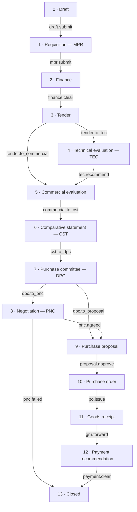
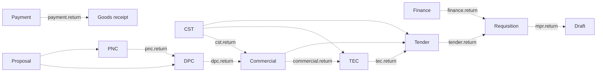

# Procurement

The procurement portal is a second product inside the same application. It carries a purchase from the moment somebody asks for something to the moment the invoice is cleared, through fourteen stages and sixteen roles, with every movement recorded.

It is reached from its own door on the landing page — not from the document workspace header — and it has its own sign-in, its own shell, and its own navigation. A person who only does procurement never sees the document workspace, and vice versa.

- **Branch:** `feat/procurement`
- **Backend:** Postgres in the existing self-hosted Supabase stack. No new service.
- **Migrations:** `supabase/migrations/20260903120000_procurement_foundation.sql` and the four slices after it.
- **Front end:** `src/features/procurement/` and `src/pages/procurement/`.

---

## 1. What is built, and what is not

**Built (the foundation slice).**

- The full fourteen-stage lifecycle as data, not code: stages, their order, their entry statuses, their timers, the legal moves between them, and every stage action, all stored as rows.
- The stage engine: one database function that validates a decision, moves the case, and writes the trail.
- Sixteen roles, twenty-six permissions, and the role-to-permission matrix.
- Row-level security on every table, with a single visibility predicate the whole schema shares.
- The portal: sign-in, a role-specific dashboard, queues, a register of all cases, a "waiting on you" worklist, the case file with a stage index, an action bar, a clarification thread, an audit trail, and case documents that ride the existing document ingest pipeline.
- The requisition stage in full: the requisition record, an itemised bill of quantities that prices itself, the budget ledger it is charged against, supporting documents on the case, and a completeness gate the database enforces before finance ever sees it.
- **Reading a bill of quantities out of a file** — a supplier's spreadsheet, a CSV, or a scope of work as a PDF — through the product's own model, offered back for review rather than written straight into the case.
- **Asking questions about a case.** Everything attached goes through the ordinary ingest pipeline, and the assistant answers over the case's own paperwork for anyone allowed to see the case.
- The case activity timeline — decisions, movements, questions, send-backs and paperwork on one rail, at every stage.
- `/procurement/insights`: pipeline, intake, spend, time at each desk, budget headroom and stage aging, all counted under the reader's own visibility.
- Digital signatures on the sixteen actions that need one, refused by the engine when absent, with a reusable signature per signer.
- The tender stage in full: the tender record and its lifecycle, the vendor register, the invitation list, a published bill of quantities frozen at floating, the roster of recorded bids with their earnest money, corrigenda that can be issued and withdrawn, a notice generated from a frozen snapshot and filed on the case, and a gate the database enforces before the committee sees anything.
- The technical evaluation stage in full: a committee that constitutes itself the moment a case arrives, a four-item governance checklist shared by the whole committee, an unsigned per-member reading of every bid (score, compliance, a qualified verdict), a computed consensus a chair can weigh members against, an on-request AI-suggested reading of a bidder's own papers against the tender's requirements that a member can accept or override, and the chair's own separate, unsigned final qualification call — the one thing that gates recommending the case for commercial evaluation, which is itself the signed action.
- `/procurement/admin`: the master data behind every requisition — the seven lookup lists, the budget ledger and the vendor register — editable in the portal instead of in `psql`.
- Demo accounts, one per role, seeded automatically.

**Not built yet (later slices of the plan).**

- The working detail of the stages after technical evaluation: quotations and the comparative statement, committee meetings and votes, negotiation rounds, proposals, purchase orders, goods receipt notes, payment recommendations. The stages exist and a case moves through all of them; each one currently shows the case summary and the requisition it came from rather than its own working form.
- Role assignment. Master data has a screen now; who holds which desk is still database work.
- Case-specific committee rosters for DPC and PNC. TEC's own committee now constitutes itself on arrival (§4.5); DPC and PNC still need the manual step in §10.4.
- Stage guards beyond the requisition, the tender and technical evaluation. `procurement_stage_actions.guard_function` is wired and `mpr.submit`, `tender.to_tec`, `tender.to_commercial` and `tec.recommend` use it; the later stages have no preconditions yet beyond permission and remarks.
- SLA escalation. `sla_hours` and `escalation_role` are stored per stage but nothing acts on them.

---

## 2. Getting in

| Where | What it is |
|---|---|
| `/` → the "procurement portal" band | The entry point on the landing page. Explains the ten-step chain and offers the door. |
| `/procurement/sign-in` | The portal's own sign-in. Public. Somebody already signed in is offered the portal rather than asked for a password again, and is told plainly if they hold no procurement desk. |
| `/procurement` | The portal dashboard, shaped by the role signed in. |
| `/procurement/register` | Every case the person is allowed to see, filterable. |
| `/procurement/inbox` | "Waiting on you" — open cases sitting at a stage this person can act on, oldest first. |
| `/procurement/queue/:queueKey` | One desk's queue. Twelve queue keys, listed in §5.4. |
| `/procurement/insights` | The pipeline in charts: workload, intake, spend, time at each desk, budget headroom, aging. |
| `/procurement/new` | Raise a requisition. Needs `mpr.create`. `?case=PC-…` reopens a draft in progress. |
| `/procurement/case/:caseNo` | The case file. |
| `/procurement/admin` | Master data: the seven lookup lists and the budget heads. Needs `master_data.manage`, so only the procurement administrator sees the link. |

Every route except the sign-in is wrapped in `RequirePermission`, which sends an unauthenticated visitor to `/procurement/sign-in` rather than to `/auth`.

After sign-in, a person holding exactly one role lands on that role's queue; anybody holding several roles, or the administrator, lands on `/procurement`. The mapping lives in `portalHome()` in `src/features/procurement/lib/portals.ts`.

---

## 3. The lifecycle

### 3.1 The chain



### 3.2 The way back

Backward moves are not free. A case may only return along a path that exists as a row in `procurement_return_paths`, and only through an action that declares that target. There are fourteen such paths:



Some of these paths are declared in the data but have no action wired to them yet — `cst → tec`, `cst → tender`, `purchase_proposal → dpc`, `purchase_proposal → pnc`, `mpr → draft`. They are legal moves that a later slice will offer a button for; today only the paths with an action code above can be taken through the portal.

Forward jumps of any distance are always allowed. `→ closed` is always allowed. Staying at the same stage is allowed, which is how a clarification works.

### 3.3 Rejection

Rejection is terminal and possible from six stages: finance, TEC, commercial, DPC, purchase proposal, and payment. It is not an ordinary transition. `procurement_reject_case()` parks the case back at the requisition stage with the status `Rejected`, sets `case_status = 'rejected'`, and writes who rejected it, when, at which stage, and why into `procurement_cases.rejection` as JSON. A rejected case is `open = false`, so no queue and no worklist picks it up again, but the requester can still open it and read the reason.

---

## 4. Stage by stage

Fourteen stages, from `procurement_stage_config`. "Timer" is the SLA in hours; nothing enforces it yet.

| # | Stage | Label | Status on arrival | Timer | Escalates to | Required |
|---|---|---|---|---|---|---|
| 0 | `draft` | Draft | Draft | — | — | yes |
| 1 | `mpr` | Requisition | Requisition raised | 72 h | Purchase head | yes |
| 2 | `finance` | Finance | Awaiting finance clearance | 72 h | Purchase head | yes |
| 3 | `tender` | Tender | Tender in preparation | 168 h | Purchase head | yes |
| 4 | `tec` | Technical evaluation | Technical evaluation underway | 120 h | TEC chairperson | yes |
| 5 | `commercial` | Commercial evaluation | Commercial evaluation underway | 120 h | Head of division | yes |
| 6 | `cst` | Comparative statement | Comparative statement under scrutiny | 72 h | Head of division | yes |
| 7 | `dpc` | Purchase committee | Before the purchase committee | 168 h | DPC chairman | yes |
| 8 | `pnc` | Negotiation | In negotiation | 168 h | PNC chairman | **optional** |
| 9 | `purchase_proposal` | Purchase proposal | Proposal under review | 120 h | Approving authority | yes |
| 10 | `purchase_order` | Purchase order | Purchase order in preparation | 72 h | PO officer | yes |
| 11 | `goods_receipt` | Goods receipt | Awaiting delivery | — | Stores and accounts | yes |
| 12 | `payment_recommendation` | Payment | Payment being processed | 120 h | Stores and accounts | yes |
| 13 | `closed` | Closed | Closed | — | — | yes |

### 4.1 Every action

All thirty-six moves, from `procurement_stage_actions`. "Remarks" means the engine refuses the action without them. "Sign" is the `requires_signature` flag — the engine refuses the action without a signature (§7.3). "Chair" means only the chairperson of that stage's committee (or the procurement administrator) may take it.

| Code | At stage | Button | Permission | Moves to | Remarks | Sign | Chair |
|---|---|---|---|---|---|---|---|
| `draft.submit` | draft | Raise requisition | `mpr.create` | mpr | | | |
| `mpr.submit` † | mpr | Send for finance clearance | `mpr.create` | finance | | | |
| `finance.clear` | finance | Clear the budget | `finance.approve` | tender | ✓ | ✓ | |
| `finance.query` | finance | Ask the requester a question | `finance.approve` | — (holds) | ✓ | | |
| `finance.return` | finance | Return to the requester | `finance.reject` | mpr | ✓ | | |
| `finance.refuse` | finance | Refuse the budget | `finance.reject` | rejected | ✓ | ✓ | |
| `tender.to_tec` † | tender | Hand off for technical evaluation | `tender.create` | tec | | ✓ | |
| `tender.to_commercial` † | tender | Open commercially without evaluation | `tender.create` | commercial | ✓ | ✓ | |
| `tender.return` | tender | Return to the requester | `tender.create` | mpr | ✓ | | |
| `tec.recommend` † | tec | Recommend for commercial evaluation | `tec.chair` | commercial | ✓ | ✓ | ✓ |
| `tec.query` | tec | Seek clarification from a bidder | `tec.chair` | — (holds) | ✓ | | ✓ |
| `tec.return` | tec | Return to the tender desk | `tec.chair` | tender | ✓ | | ✓ |
| `tec.refuse` | tec | Reject all bids on technical grounds | `tec.chair` | rejected | ✓ | ✓ | ✓ |
| `commercial.to_cst` | commercial | Draw up the comparative statement | `commercial.evaluate` | cst | | | |
| `commercial.query` | commercial | Seek a commercial clarification | `commercial.evaluate` | — (holds) | ✓ | | |
| `commercial.return` | commercial | Return to technical evaluation | `commercial.evaluate` | tec | ✓ | | |
| `commercial.refuse` | commercial | Reject all bids | `commercial.evaluate` | rejected | ✓ | ✓ | |
| `cst.to_dpc` | cst | Place before the purchase committee | `commercial.evaluate` | dpc | | | |
| `cst.return` | cst | Reopen commercial evaluation | `commercial.evaluate` | commercial | ✓ | | |
| `dpc.to_pnc` | dpc | Refer for price negotiation | `dpc.chair` | pnc | ✓ | | ✓ |
| `dpc.to_proposal` | dpc | Approve and raise a purchase proposal | `dpc.chair` | purchase_proposal | ✓ | ✓ | ✓ |
| `dpc.query` | dpc | Seek clarification before deciding | `dpc.chair` | — (holds) | ✓ | | ✓ |
| `dpc.return` | dpc | Return to commercial evaluation | `dpc.chair` | commercial | ✓ | | ✓ |
| `dpc.refuse` | dpc | Reject the procurement | `dpc.reject` | rejected | ✓ | ✓ | ✓ |
| `pnc.agreed` | pnc | Conclude — agreement reached | `pnc.chair` | purchase_proposal | ✓ | ✓ | ✓ |
| `pnc.return` | pnc | Refer back to the purchase committee | `pnc.chair` | dpc | ✓ | | ✓ |
| `pnc.failed` | pnc | Close — negotiation failed | `pnc.chair` | closed | ✓ | ✓ | ✓ |
| `proposal.approve` | purchase_proposal | Approve and raise the purchase order | `proposal.approve` | purchase_order | ✓ | ✓ | |
| `proposal.revise` | purchase_proposal | Return for revision | `proposal.approve` | — (holds) | ✓ | | |
| `proposal.refuse` | purchase_proposal | Reject the proposal | `proposal.approve` | rejected | ✓ | ✓ | |
| `po.issue` | purchase_order | Issue the purchase order | `po.issue` | goods_receipt | | ✓ | |
| `grn.forward` | goods_receipt | Forward for payment | `grn.create` | payment_recommendation | | | |
| `payment.clear` | payment_recommendation | Approve payment and close | `payment.process` | closed | ✓ | ✓ | |
| `payment.hold` | payment_recommendation | Hold the payment | `payment.process` | — (holds) | ✓ | | |
| `payment.return` | payment_recommendation | Return to stores | `payment.process` | goods_receipt | ✓ | | |
| `payment.refuse` | payment_recommendation | Refuse the payment | `payment.process` | rejected | ✓ | ✓ | |

† The four actions carrying a guard. `procurement_guard_requisition_ready` refuses `mpr.submit` unless the case has a title, a department, a needed-by date and an estimated cost above zero. `procurement_guard_tender_ready` refuses both ways out of the tender desk unless the tender has a reference number and a deadline, has satisfied whatever its mode obliged, has had bidding closed, and carries at least one recorded bid with an amount against it. `procurement_guard_tec_ready` refuses `tec.recommend` unless the chair has marked at least one bidder qualified — it does not require every member to have submitted a reading first, and it does not check the checklist. Everything else is checked by permission and remarks alone.

Floating a tender, closing bidding and issuing a corrigendum are **not** in this table. They move the tender, not the case, so they are database functions rather than stage actions — see §4.4. A member's technical evaluation is the same shape of exception: it is a record on file, not a case transition, so it is `procurement_submit_tec_evaluation` rather than a row here — see §4.5. `tec.recommend` itself stays in the table above, signature and all, since that one *is* the transition.

An action with no target stage holds the case where it is and changes its status label — `Awaiting a reply from the requester`, `Awaiting a bidder clarification`, `Payment on hold`, and so on. Actions of kind `send_back` and `request_clarification` also open a thread on the case, so the person it was sent to sees the question, not just a status.

### 4.2 What happens at each stage

**Draft.** The requester opens the case: a title, a department, an estimated value, and a justification. The case gets a reference of the form `PC-2026-0001` from `procurement_next_ref()`. Nobody else is involved yet.

**Requisition (MPR).** The requisition proper — bill of quantities, budget head, supporting documents. The requester submits it to finance. *(The BoQ and budget-head forms arrive with a later slice; today the stage carries the case summary and its attachments.)*

**Finance.** The finance officer decides whether the budget head can carry the purchase. Clearing it requires remarks and is flagged for signature. They may instead ask the requester a question (the case stays at finance), return it for correction (back to the requisition), or refuse it outright (terminal).

**Tender.** The purchase officer sets the tender up — its reference, how it is being floated, the dates, the earnest money and fees — and floats it. Floating publishes a copy of the requisition's bill of quantities and freezes the notice. The tender itself goes out somewhere else, on a portal or by hand; the officer records the firms that bid and what they quoted, then closes bidding. Anything that changes after the notice has gone out is a corrigendum. They then either hand the case to the technical evaluation committee, or — for a purchase that does not warrant technical evaluation — open it commercially straight away, with remarks explaining why. Either move is refused until the tender is actually ready (§4.4). A requisition that turns out to be wrong can be sent back to the requester before anything is floated.

**Technical evaluation (TEC).** Each member reads every bid — its papers, a score, a compliance call, a qualified verdict, remarks — and signs it; a member's reading never touches the case, it is one row the chair can weigh against the others. Only the chairperson moves the case on, and only with remarks. The chair's own final qualification call on each bidder is separate from any member's and is what the recommend action reads: it can be made independently of whether every member has submitted, mirroring the assumption that a case should not stall on a committee member who never logs in. The chair may recommend qualified bids for commercial evaluation (refused until at least one bidder is marked qualified — §4.5), seek a clarification from a bidder, return the case to the tender desk, or reject all bids on technical grounds.

**Commercial evaluation.** The head of division approves the format for opening commercial bids; the commercial team prices the bids against the bill of quantities and ranks them. The team then draws up the comparative statement, seeks a clarification, returns the case to technical evaluation, or rejects all bids.

**Comparative statement (CST).** The statement is scrutinised and locked before the case is listed for the committee. It can be reopened for correction, which sends the case back to commercial evaluation.

**Purchase committee (DPC).** The committee sits, votes and records a resolution. The chairman then either refers the case for price negotiation, or approves it and sends it for a purchase proposal; both need remarks. The chairman may also hold the case for a clarification, return it to commercial evaluation, or reject the procurement.

**Negotiation (PNC).** The only optional stage. The negotiation committee runs rounds against the committee's mandate. The chairman concludes with an agreement (the case goes to purchase proposal), refers the case back to the purchase committee, or closes it as a failed negotiation.

**Purchase proposal.** The approving authority clears the proposal before an order can be raised against it, returns it for revision, or rejects it.

**Purchase order.** The PO officer raises the order from the approved proposal and issues it to the vendor. Issuing it opens the goods receipt.

**Goods receipt.** Stores records what arrived, what was inspected, and what was accepted, then forwards the accepted quantities to the payment desk.

**Payment recommendation.** Accounts prices the invoice against the accepted quantities, applies any penalty deduction, and recommends payment. Approving the payment closes the case. The desk may also hold the payment, return the case to stores for a receipt correction, or refuse payment.

**Closed.** End of the line. `case_status` becomes `closed` and `closed_at` is stamped.

---

### 4.3 The requisition stage in detail

The requisition is where a case gets its substance, so it is the one stage with a form of its own. It lives on one scrolling page — `/procurement/new` for a fresh one, the case file for one that came back — rather than a step wizard, because a requester rarely learns the facts in the order a wizard insists on.

**Opening a draft.** A title and a department are all it takes. The case number (`PC-2026-0001`) comes back immediately, because nothing can be attached to a case that does not exist yet. The draft is visible to its author and the procurement administrator, nobody else, and `?case=PC-…` reopens it after leaving.

**What is needed.** Title, why it is needed, department, material category, procurement type, priority, cost centre, delivery point, the date it is needed by, and any delivery or installation note the vendor will need. Everything but the title and department is optional at this point; the gate in front of finance says which of them stop the case moving.

**The bill of quantities.** An editable table: item, specification, quantity, unit, HSN code, estimated rate. The line amount is computed by the database (`quantity × rate`), never by the browser, so a client cannot disagree with the arithmetic. The bill is optional — a service or a lump-sum job has none, and forcing one only produces a single line reading "the work".

**The money.** A budget head is picked from the live ledger, which shows what each head has left after every case already charged to it. The estimated value comes either from the bill total or from a figure typed by hand; the choice is recorded as `cost_source`, and a trigger keeps `procurement_cases.estimated_cost` equal to whichever was chosen. Choosing the bill is only offered once at least one line carries a rate. If the value exceeds what the head has left, the shortfall is named on the page — it does not block the case, because a budget revision is a finance decision, not a form validation.

**Supporting documents.** Uploads go through the product's ordinary ingest pipeline: the file lands in `documents`, joins the processing queue, is OCR'd and indexed, and is then linked to the case with the part it plays (`Cost estimate`, `Bill of quantities`, `Drawing`, and so on). That is why a case attachment is answerable by the assistant without a second pipeline. What the file *is* is guessed from the stage and corrected afterwards, never asked for first — see §7.2.

**Reading the bill out of a file.** Most requesters are handed the items rather than typing them: a supplier's quotation as a spreadsheet, a CSV export, an engineer's scope of work as a PDF. **Read items from a file** does two things with one pick:

1. The file is attached to the case like any other document — stored, queued, read, indexed, and answerable by the assistant.
2. Its items come back as draft lines.

A spreadsheet or CSV is parsed in the browser and its own cells are sent to the model, which is far better evidence than a rendering of the same table; a PDF or Word file is read from the text the ingest pipeline produced, and if the queue has not finished, the panel says so and offers a retry rather than returning an empty bill. The model returns item, specification, quantity, unit, HSN code and per-unit rate; totals, taxes and page furniture are ignored.

**Nothing is written without being shown.** The result appears as a table with what the model made of the file, and the requester chooses **Use these items**, **Add to the bill**, or discards it. An extraction that saved itself would be worse than retyping, because nobody would check it. Rates in Indian formatting (`1,25,000`, `₹ 40,00,000`) are parsed to plain numbers; anything the model could not read comes back empty rather than guessed.

**The gate.** Four things: a title, a department, a needed-by date, a cost above zero. All four are enforced by the database in `procurement_guard_requisition_ready`, so no client can put an incomplete requisition in front of finance, and `procurement_requisition_gaps(case)` returns the same four as a list.

**Saying so on screen.** The gaps function reads committed rows, so a checklist driven by it alone only moves when the requester next presses Save — which is exactly when they have stopped looking at it. The same four rules therefore also live in `lib/requisitionChecks.ts`, evaluated against the unsaved form, and that copy is what paints the page:

- A checklist at the top counts what is left and lists it. **Each row is a button that scrolls to the field and focuses it**, because the page is four sections long and naming "the date it is needed by" without saying where it lives is what made the form feel unfinishable.
- Every required control carries a `needed` chip and a red border while empty, and a green tick once filled. Colour never carries it alone — there is a word or an icon beside every use, since red-against-green is the one pair a colourblind reader cannot separate. `--ok` was added to the design system for this; it is not `--signal`, which stays reserved for what the machine found.
- Each step's header shows `2 to fill in` or a green `done`. Optional steps show nothing rather than a tick they have not earned.
- The raise bar names the outstanding items instead of saying "finish the items listed above".

The client copy decides what is painted; the database still decides whether the case moves. If they disagree — an unsaved edit, or a client rule that has drifted from the guard — the checklist says so and points at Save, so nobody meets a refusal from the engine without a reason.

**Documents are optional.** A requisition for a service or a lump-sum job may have nothing to attach, so paperwork is suggested, never demanded: the portal says nothing is attached and that finance will ask if they need something. This was a deliberate reversal — an earlier version listed documents as a gap and quietly blocked exactly those cases.

**Raising it.** One button does two recorded things: `draft.submit` raises the case out of draft, then `mpr.submit` puts it to finance. Both go through the engine and both appear in the trail, so a single act by the requester is still two honest entries.

### 4.4 The tender stage in detail

**The vendor register comes first.** A bid points at a row in `procurement_vendors` rather than carrying a typed name, and the name is unique. That is the whole reason the register exists: matching firms by name across stages makes "Meridian Instruments" and "Meridian Instruments Pvt Ltd" the same supplier by luck, and nothing counted afterwards can be trusted. A vendor is never deleted — bidder and invitee rows reference it `ON DELETE RESTRICT` — so the register offers retiring and barring instead, and says so.

**The lifecycle.** A tender moves `draft → ready → floated → bidding open → bidding closed`. Those moves are database functions, not stage actions, because they move the *tender* and leave the case where it is. Three reasons they are functions rather than plain writes, and the same three apply to any later slice tempted to skip them:

1. The transitions are constrained, and a `CHECK` cannot see the old row. One function per transition keeps the precondition next to the stamp it writes.
2. They have to be auditable. `procurement_case_activity` reads `procurement_case_events`; a direct `UPDATE ... SET status = 'floated'` writes no event and the tender's whole life is invisible on the timeline. A trigger could log it but could not capture remarks.
3. They are multi-table. Floating publishes the bill and freezes the notice; a corrigendum writes the amendment and mutates the bill.

The split, in one line: **row-level security for the fields, functions for the transitions.**

**How it is floated.** `mode` records the route — open, limited, single source, GeM, an e-procurement portal — and what the officer picks decides what else is obliged: a portal mode needs the number that portal gave the tender, a limited or single-source mode needs an invitation list, and a single source needs a written justification. There are deliberately no value thresholds anywhere: which mode a given estimate obliges is policy that differs by organisation and by year, so the portal records the choice and validates its consequences rather than pretending to know the rule.

**The published bill is a snapshot, not a view.** `procurement_tender_items` is a copy of the requisition's bill, taken at floating. Once a bidder has quoted against line 3, line 3 has to mean forever what it meant then; the requisition is still correctable in principle, and a change to what bidders were shown has to be a numbered, dated event rather than something a reader can only spot by noticing the total moved. The freeze needs no trigger — the write policy on the snapshot only matches while the tender is `draft` or `ready`, and `procurement_issue_corrigendum` is `SECURITY DEFINER` and so is not subject to it. The roster closes the same way when bidding does.

**The notice.** Floating writes `notice_snapshot`: every field the printed notice states, as of that moment. Nothing re-renders it from the tender's live columns, which is the point — a notice issued on the 3rd must not change because the tender was edited on the 5th. "File it on the case" renders the snapshot to a PDF and pushes it through `attachDocumentToCase`, the same path an uploaded scan takes, flagged `is_generated`. So the notice is stored, OCR'd, embedded and answerable by the case assistant like any other paper on the file. It is the first thing in the product to set `is_generated`, which had been a column with no producer since the foundation.

**Bids are recorded, not submitted.** There is no bidder-facing door, so the portal makes no sealed-bid promise it could not keep. The tender goes out on a portal or by hand and the purchase officer enters what came back: the firm, its reference, the amount, the tax rate, the earnest money and its settlement, and the terms quoted. `bid_amount_gross` is a generated column, so "did they quote inclusive of tax?" is arithmetic rather than an argument three stages later. The roster is a list and not a ranking — nothing here sorts by amount or names a lowest bidder, because bids only become comparable once the committee has said which ones qualify and the comparative statement has brought them to the same terms.

**A bid brings its own papers.** A bid is a claim — this firm can do the work, holds these registrations, has done it before — and the certificates backing it arrive in the same envelope, so they are recorded in the same act. The **Record a bid** form carries a papers section: files chosen there are held until the insert returns an id, then attached to the new row, and the roster opens on it so the officer can see them land. Editing an existing bid attaches immediately, since there is already a row to attach to. Each bidder row also expands to its own document list, and anything filed either way is an ordinary case document carrying one extra column, `procurement_case_documents.bidder_id`. Same bucket, same ingest, same OCR, same embeddings; the attribution is the only new thing.

That attribution is what makes the technical evaluation answerable. Asked across a whole case, *"does this firm hold a valid electrical licence?"* retrieves the licence a **different** bidder sent and answers yes — confidently, and wrongly. `procurement_search_case_chunks` therefore takes an optional `_bidder_id`, and **Ask about this bid** points the case assistant at one firm's submission alone, so an absent certificate looks absent. On a qualification question that is the difference between a gap and a false clearance.

The roster shows how much of each submission has been read and says so plainly, because a half-indexed bundle gives thin answers and a reader who cannot see that will mistake *not yet read* for *not provided*. Papers stay attachable after bidding closes and after the case moves on — a clarification a firm sends during the evaluation has to go on the file, and refusing it would only push the paper somewhere the assistant cannot reach. Removing a bidder does not delete their papers; the foreign key is `ON DELETE SET NULL`, so the documents stay on the case attributed to nobody, which is the honest record of what happened.

`procurement_bid_submissions(case)` puts each firm, its bid status and its document counts in one row. It is deliberately not an evaluation and carries no score: turning a submission into a per-requirement verdict is the technical evaluation slice, and it will read this.

**The hand-off closes bidding.** Whichever way the case leaves the desk, bidding shuts on the way out — which is what `tender.to_tec` has described itself as doing since the foundation migration. An earlier version of this slice guarded the action on bidding *already* being closed, so the officer pressed the button the description told them to press, signed it, and was refused for not having pressed a different button first. The explicit **Close bidding** control stays, because shutting the roster early is a real thing to want while chasing a missing amount or verifying earnest money; it is a convenience, not a toll gate.

It is an `AFTER UPDATE OF stage` trigger on the case rather than a step inside the two actions, because `procurement_advance_stage` is the only thing that writes `cases.stage` — so it catches every way out of the desk, including one a later slice adds and the administrator moving a case by hand. The automatic close is logged like any other, so the trail still shows when the roster shut.

**Both ways out are signed.** Whichever is taken, a set of bids stops being the purchase officer's working list and becomes the record a committee decides on — the same kind of act as finance clearing a budget or the authority approving a proposal, both of which have always been signed. The tender desk was the only exception and there was no principle behind it. `tender.return` stays unsigned: sending a requisition back for correction commits nobody to anything.

**Corrigenda.** The only way a floated tender changes. Each is numbered within its tender (it gets cited by number in correspondence), categorised as schedule, technical, commercial or administrative, and carries what the tender looked like before it — which is what makes withdrawing one possible. Only the most recent can be withdrawn, because reversing an earlier amendment underneath a later one would restore a state nobody was ever notified of. An amendment that moves the published value sets `needs_finance_review`. Recording that a bidder was told is a row in `procurement_corrigendum_notices`; the telling itself happens elsewhere, and nothing in this slice sends email.

**The gate.** `procurement_guard_tender_ready` refuses both ways out of the desk until bidding has actually happened: a reference number, a deadline, whatever the mode obliged, bidding closed, at least one recorded bid, and an amount against every one of them. `procurement_tender_gaps` lists what is missing, and `src/features/procurement/lib/tenderChecks.ts` mirrors the same rules against the unsaved form so the checklist moves as the officer types. The two must not drift — same arrangement, and the same warning, as the requisition's.

### 4.5 The technical evaluation stage in detail

**Two roles, two different writes.** A member's own reading of a bid — score, compliance, a qualified verdict, remarks — never touches the case; it is one row in `procurement_tec_evaluations`, keyed on `(bidder_id, member_id)`, and a member who reconsiders resubmits rather than appending a second row. The chair's own qualification call lives on the bidder itself (`procurement_bidders.tec_qualified`), separate from any member's row, visible to everyone, and it alone is what `procurement_guard_tec_ready` reads. Neither waits on the other: the chair can qualify a bidder before any member has scored it, and a member can score a bid the chair already decided on, purely for the record.

**A member's reading is written through a function rather than a table write — but it is not signed.** `procurement_tec_evaluations` carries no client-writable row-level security policy at all: the table is read-only from the API, and the only way to put a row in it is `procurement_submit_tec_evaluation`, `SECURITY DEFINER`, which checks the caller holds `tec.evaluate` or `tec.chair` and then upserts the row. It does *not* require a signature, on reflection: the reading does not move the case, only the chair's separate qualification call does that, and `tec.recommend` already carries its own required signature (and has since the foundation). Signing every reading was ceremony with nothing riding on it; there is nothing to get wrong about a missing RLS policy here regardless, because there is deliberately no policy to be missing.

**The TEC committee constitutes itself.** Chair-only actions check both the `tec.chair` permission and `is_procurement_committee_chair()` — the second reads an actual `procurement_committees` row for that case, and nothing in this product's own UI offers a way to create one. Left as a manual `psql` step (§10.4 below still describes it for DPC and PNC), a real chair who had qualified a bidder would hold every permission the engine asks for and still see an empty action bar, indistinguishable from the engine being broken. TEC is the one committee stage this product now drives end to end through its own screens, so it is the one that no longer waits on that step: the moment a case arrives at `tec`, a trigger constitutes a one-cycle TEC committee and seats every org-wide holder of `tec_chairman` (as chair) and `tec_member`. That is a real, stated limit — a large organisation with several TEC chairs would want a committee scoped to the case's own department or category, not every chair in the org — but it is the same shape of limit case-specific role assignment already carries everywhere else in this product, and it is what actually lets a chair press a button instead of asking someone to run SQL. DPC and PNC are untouched.

**The chair's call is a function too, for a narrower reason.** `procurement_bidders.tec_qualified` is a field, not a transition, so in principle it could sit under an ordinary row-level security write policy the way the tender's own columns do. It does not, because a column-scoped policy does not exist in Postgres — a policy is row-level, and the bidder row already carries fields other roles legitimately write (the bid amount, at the tender desk). `procurement_set_bidder_qualification` is the narrow function that exists instead: it checks `tec.chair`, checks the case is actually at this desk, and writes exactly those four columns. The existing bidder write policy already stops matching once the case leaves the tender stage, so a plain client `UPDATE` at this point changes nothing regardless — checked directly in both test scripts, because "changes nothing" is exactly the failure mode that bit this project before and deserves an assertion, not an assumption.

**The checklist is a plain field.** Four fixed questions — do the specs match the requisition, are the mandatory documents in, is delivery feasible, is eligibility verified — seeded onto the case the moment it reaches `tec` (a trigger, backfilled once for any case already there when the migration ran). Shared by the whole committee, editable under an ordinary row-level security policy scoped to `tec.evaluate` or `tec.chair` while the case sits at this desk. It is there for the record, not for the gate: neither the checklist nor a full house of member submissions is required before the chair can qualify a bidder and recommend.

**Consensus is computed, never stored.** `procurement_tec_case_consensus(case)` aggregates `procurement_tec_evaluations` per bidder — how many members have scored it, their average, how many called it qualified, and the percentage — fresh on every read, the same reasoning as `procurement_tender_summary`: a stored rollup would drift the moment a member resubmitted.

**The gate.** `procurement_guard_tec_ready` refuses `tec.recommend` until at least one bidder carries `tec_qualified = true`. That is the only hard rule, deliberately: it does not require every member to have submitted a reading, and it does not require the checklist to be clean — both are the chair's judgement, not the engine's.

**An AI suggestion is a starting point, never a vote.** "Ask the assistant" (`supabase/functions/tec-ai-evaluate`) builds the requirement side of the judgement from the tender's eligibility and scope fields, the published bill, *and* the text of whatever case documents were filed with no bidder attached — because the real qualification criteria very often lives only in an uploaded PDF from the requisition stage, not retyped into the tender's own fields. Judging bidders against a blank eligibility box because the officer never retyped the PDF into it would silently throw away the one document that actually states the rule. It then retrieves that one bidder's own excerpts the same way `procurement_search_case_chunks` does for "Ask about this bid", and asks the chat model for a score, a compliance call, a qualified verdict and the evidence behind each. **Ask the assistant for every bid**, beside the section heading, runs this once per bidder in sequence — never in parallel, since one remote endpoint gains nothing from a burst of concurrent calls — and reports which bidders it could not read (no papers, or papers still being read) rather than silently skipping them. Three things keep any of this from ever quietly becoming a decision:

1. **It lands in its own table**, `procurement_tec_ai_suggestions` — one row per bidder, never in `procurement_tec_evaluations`. Mixing a model's guess into a member's row would make an override indistinguishable from an original reading.
2. **Nothing that decides whether the case can move reads it.** `procurement_guard_tec_ready` looks at `tec_qualified` alone, and that column is set only by a human, signed action.
3. **It only ever fills an unsent draft, never a signed one.** The score, compliance and verdict land in "my reading" the moment a fresh suggestion comes back — but only while the member has nothing signed yet, so asking again after a reading is already on file cannot silently overwrite it. "Use this as my starting point" stays available on the suggestion itself for pulling it in deliberately at any other time. Either way nothing is submitted: the member still edits, still writes their own remarks, and still signs, the same as if they had typed the numbers themselves.

It refuses rather than guesses when there is nothing to work from: no papers filed, papers still being read, or a tender with no eligibility, scope or bill text to check against. The model is told to mark a requirement "unclear" or "not_met" when the excerpts do not address it — never "met" from silence — and `enable_thinking: false` is set the same way `translate-document` sets it, because Qwen3.5 otherwise reasons at length in plain prose that both burns the token budget and leaves nothing but chatter for the response parser.

### 4.6 The activity timeline

`procurement_case_activity(case)` merges four sources into one reverse-chronological trail — decisions from `procurement_case_events`, movements from `procurement_stage_history`, questions and send-backs from `procurement_clarifications`, and paperwork from `procurement_case_documents` — each with who did it, when, at which stage, and the remarks they left. The interleaving happens in the database rather than in the browser.

The portal draws it as one component on the case file, and it is the same component at every stage: a tender's activity and a payment's activity are the same shape of fact. Gaps between entries are shown as elapsed time ("4 days later"), which is what makes a stalled case visible without reading timestamps.

### 4.7 Asking about a case

Every file attached to a case rides the product's ordinary ingest — stored, OCR'd where needed, chunked and embedded — so a case's paperwork is already searchable the moment it finishes processing. **Ask about this case** puts the existing assistant in front of it, scoped to that case.

The scoping matters and is not a filter in the browser. The archive's own search (`search_documents_by_embedding`) is limited to chunks the asker uploaded, which is right for a personal archive and wrong for a case file: a finance officer asking about a requisition is asking about a file the requester attached. `procurement_search_case_chunks(case, user, embedding, …)` searches the documents linked to one case, checks `procurement_can_view_case` first, and returns nothing at all to somebody outside the case. `rag-assistant` takes a `caseId` and uses it instead of the personal search; everything downstream — reranking, citations, conversation history — is unchanged.

The panel shows how much is ready (`procurement_case_document_readiness`), polls while anything is still being read, offers three opening questions so nobody faces an empty box, and cites the documents each answer came from.

## 5. Roles, permissions and desks

### 5.1 The sixteen roles

| Role | Demo account | Portal title | Step |
|---|---|---|---|
| `proc_admin` | `admin@jyoma.ai` | Administration | all |
| `purchase_head` | `head@jyoma.ai` | Oversight (read-only) | all |
| `requester` | `requester@jyoma.ai` | Requisitions | 1 |
| `finance_user` | `finance@jyoma.ai` | Budget clearance | 2 |
| `purchase_officer` | `tender@jyoma.ai` | Tendering | 3 |
| `tec_chairman` | `tec.chair@jyoma.ai` | Technical evaluation — chair | 4 |
| `tec_member` | `tec.member@jyoma.ai` | Technical evaluation | 4 |
| `head_of_division` | `hod@jyoma.ai` | Divisional approvals | 5 |
| `commercial_team` | `commercial@jyoma.ai` | Commercial evaluation | 5 |
| `dpc_chairman` | `dpc.chair@jyoma.ai` | Purchase committee — chair | 6 |
| `dpc_member` | `dpc.member@jyoma.ai` | Purchase committee | 6 |
| `pnc_chairman` | `pnc.chair@jyoma.ai` | Price negotiation — chair | 7 |
| `pnc_member` | `pnc.member@jyoma.ai` | Price negotiation | 7 |
| `management_approver` | `approver@jyoma.ai` | Approving authority | 8 |
| `po_officer` | `po@jyoma.ai` | Purchase orders | 9 |
| `receipt_payment_officer` | `payments@jyoma.ai` | Stores & accounts | 10 |

### 5.2 The twenty-six permissions

`view_self`, `mpr.create`, `mpr.view`, `oversight.view`, `finance.approve`, `finance.reject`, `tender.create`, `tec.evaluate`, `tec.chair`, `commercial.evaluate`, `commercial.opening.approve`, `dpc.approve`, `dpc.reject`, `dpc.chair`, `pnc.negotiate`, `pnc.chair`, `proposal.draft`, `proposal.approve`, `po.issue`, `grn.create`, `payment.process`, `master_data.manage`, `vendor.manage`, `manage_users`, `upload_docs`, `docs.upload`.

### 5.3 Who holds what

| Role | Permissions |
|---|---|
| `proc_admin` | all twenty-six |
| `purchase_head` | `view_self`, `mpr.view`, `oversight.view` |
| `requester` | `view_self`, `mpr.create`, `mpr.view`, `upload_docs`, `docs.upload` |
| `finance_user` | `view_self`, `mpr.view`, `finance.approve`, `finance.reject` |
| `purchase_officer` | `view_self`, `mpr.view`, `tender.create`, `vendor.manage`, `proposal.draft`, `upload_docs`, `docs.upload` |
| `tec_chairman` | `view_self`, `mpr.view`, `tec.evaluate`, `tec.chair`, `upload_docs`, `docs.upload` |
| `tec_member` | `view_self`, `mpr.view`, `tec.evaluate`, `upload_docs`, `docs.upload` |
| `head_of_division` | `view_self`, `mpr.view`, `commercial.opening.approve` |
| `commercial_team` | `view_self`, `mpr.view`, `commercial.evaluate` |
| `dpc_chairman` | `view_self`, `mpr.view`, `dpc.approve`, `dpc.reject`, `dpc.chair` |
| `dpc_member` | `view_self`, `mpr.view`, `dpc.approve`, `dpc.reject` |
| `pnc_chairman` | `view_self`, `mpr.view`, `pnc.negotiate`, `pnc.chair` |
| `pnc_member` | `view_self`, `mpr.view`, `pnc.negotiate` |
| `management_approver` | `view_self`, `mpr.view`, `proposal.approve` |
| `po_officer` | `view_self`, `mpr.view`, `po.issue` |
| `receipt_payment_officer` | `view_self`, `mpr.view`, `grn.create`, `payment.process`, `upload_docs`, `docs.upload` |

Note that `head_of_division` holds `commercial.opening.approve` but not `commercial.evaluate`, so it can approve bid opening and sign off the statement but cannot move the case on. Only `commercial_team` (and the administrator) can.

### 5.4 The twelve queues

`requisitions` (draft, mpr) · `finance` (finance) · `tender` (tender) · `technical` (tec) · `commercial` (commercial, cst) · `opening` (commercial, cst — for the head of division) · `committee` (dpc) · `negotiation` (pnc) · `proposals` (purchase_proposal) · `orders` (purchase_order) · `receipts` (goods_receipt) · `payments` (payment_recommendation).

Each queue names the permission that opens it, so the navigation only shows the queues a person can actually use. Somebody holding several roles gets the pooled set. A person with more than two queues gets them collapsed into a "Queues" menu rather than a long row of links.

### 5.5 Which desk each role sits at

`procurement_role_stages` records the stage a role owns. This is what case visibility is derived from (§6):

`finance_user` → finance · `purchase_officer` → tender · `tec_chairman`, `tec_member` → tec · `head_of_division`, `commercial_team` → commercial · `dpc_chairman`, `dpc_member` → dpc · `pnc_chairman`, `pnc_member` → pnc · `management_approver` → purchase_proposal · `po_officer` → purchase_order · `receipt_payment_officer` → goods_receipt.

The requester is deliberately absent: they see their own cases, not everybody's.

---

## 6. Who can see a case

One predicate decides, and every case-scoped policy in the schema calls it. A person can see a case when **any** of these is true:

1. They raised it (`requester_id`), or they opened it (`created_by`).
2. They are a platform administrator (`has_role(uid, 'admin')`).
3. They are the procurement administrator (`proc_admin`).
4. They hold `oversight.view` — this is the purchase head's read-everything role.
5. **A role they hold sits at or before the stage the case has reached.** The finance officer sees a case from finance onward; the PO officer sees it from the purchase order onward; nobody sees a case that has not reached their desk yet.
6. They sit on a committee constituted on that case (TEC, DPC or PNC), regardless of stage.

Rule 5 is the one worth remembering: visibility travels forward with the case. A payments officer cannot see a case still at tender. A requester can always see their own, at any stage.

The predicate exists in two shapes that cannot drift apart, because the second is defined in terms of the first:

- `procurement_can_view_case_row(user, case_id, requester_id, created_by, stage)` — takes the row's own columns. This is what the `procurement_cases` SELECT policy uses. It has to take the columns rather than re-read the row, otherwise `INSERT ... RETURNING` fails: the row being inserted is not visible to a sub-select in its own statement, so the policy would evaluate false and refuse every insert that asks for its own row back.
- `procurement_can_view_case(user, case_id)` — the id-taking wrapper, used by the child tables.

---

## 7. The data model

Thirty-two tables. The reference tables are what make the workflow data-driven: the legal moves are rows, not a `switch` statement, so changing the workflow is a migration and not a rewrite.

**Reference data** (readable by anyone signed in, writable only by the administrator)

| Table | Holds |
|---|---|
| `procurement_stage_config` | The fourteen stages: sequence, label, entry status, mandatory, SLA hours, escalation role. |
| `procurement_return_paths` | The fourteen legal backward moves. |
| `procurement_permissions` | The twenty-six permission keys and their labels. |
| `procurement_role_permissions` | The role-to-permission matrix, 90 pairs. |
| `procurement_role_stages` | Which desk each role sits at. |
| `procurement_stage_actions` | The thirty-six moves: code, stage, action kind, label, description, permission, target stage, entry status, `requires_remarks`, `requires_signature`, `chair_only`, `guard_function`, `gaps_function`, sort order. |
| `procurement_lookups` | Departments, categories, cost centres, procurement types, priorities, units, warehouses. |
| `procurement_ref_counters` | Backs `procurement_next_ref()`, which issues `PC-YYYY-NNNN`. |

**The case spine**

| Table | Holds |
|---|---|
| `procurement_cases` | One row per case: `case_no`, title, stage, status label, case status (`open`/`rejected`/`closed`), department, requester, estimated cost, currency, awarded vendor (a foreign key into the register since the tender slice; nothing writes it until the order), rejection JSON, `closed_at`. |
| `procurement_case_events` | Append-only audit. Written by the engine, never by the client. |
| `procurement_stage_history` | Every movement: from stage, to stage, status label, remarks, actor, timestamp. |
| `procurement_clarifications` | Threads. `kind` is `question` or `send_back`; threaded through `parent_id`; resolvable. |
| `procurement_case_documents` | What role a document plays in a case. The file itself lives in the existing `public.documents` table and goes through the normal ingest, OCR and embedding pipeline, so a case attachment is searchable like any other document. Twenty-two document types, from "Notice inviting tender" to "Payment recommendation". `is_generated` marks paperwork the portal produced rather than a person uploaded; the tender notice is the first thing to set it. `bidder_id` attributes a document to one firm's bid — nullable, because most paperwork belongs to the case rather than to any bidder, and `ON DELETE SET NULL` so removing a bidder cannot destroy what they sent. |
| `procurement_signatures` | One reusable signature per person. Private to its owner; no other policy reads it. |
| `procurement_case_signatures` | One row per signed decision: case, action, stage, signer, its own copy of the image, and when. Read-only to every client — written solely by the engine. |
| `procurement_user_roles` | Role grants, in their own table — the same anti-privilege-escalation shape as the app's `user_roles`. |
| `procurement_committees`, `procurement_committee_members` | TEC, DPC and PNC rosters. Members carry `is_chair`, voting rights, attendance, findings, conflict-of-interest and a signature timestamp. TEC's own committee constitutes itself on arrival at that stage (§4.5); DPC and PNC still need the manual step in §10.4. |

**The requisition**

| Table | Holds |
|---|---|
| `procurement_requisitions` | One row per case: justification, needed-by date, priority, category, procurement type, cost centre, delivery point, budget head, `cost_source` (`boq` or `manual`), the manual figure, and any delivery note. |
| `procurement_boq_lines` | The itemised bill: line number, item, specification, quantity, unit, HSN code, estimated rate, and `line_amount` as a generated column. Unique per case and line number. |
| `procurement_budget_heads` | The ledger: name, code, fiscal year, department, category, allocated amount, active. Unique on name and fiscal year. |
| `procurement_budget_commitments` | Explicit claims against a head — `commitment`, `spend` or `release`. Live cases commit automatically (see below); this table is for everything the case value does not already say. |

**The tender**

| Table | Holds |
|---|---|
| `procurement_vendors` | The register: name (unique), registration number, GST and PAN, MSME category, contact, address, whether it is in use, and whether it is barred and why. Organisation-wide, not case data. |
| `procurement_tenders` | One row per case: reference, mode, portal reference and URL, single-source justification, scope and eligibility, the lifecycle status, every date from publication to the opening of price bids, earnest money and fees, the frozen `notice_snapshot` and the document it was filed as, and the stamps the lifecycle functions write. |
| `procurement_tender_invitees` | Who was asked. Only obliged for a limited or single-source tender, and the guard enforces that rather than the schema. |
| `procurement_tender_items` | The published bill, copied from the requisition at floating. Mirrors `procurement_boq_lines` and keeps `source_line_id` with no foreign key, so the snapshot survives the requisition line being deleted. |
| `procurement_bidders` | The roster: firm, reference, amount, tax rate, `bid_amount_gross` as a generated column, earnest money and how it was settled, the terms quoted, and whether the bid stands. `case_id` is denormalised from the tender and kept honest by a trigger, because every policy in this schema is written against it. |
| `procurement_corrigenda` | Amendments: serial number within the tender, category, reason, before and after snapshots, the value moved, whether finance has to look again, and its own frozen notice. |
| `procurement_corrigendum_notices` | That a bidder was told, and by what means. A record of a notification sent elsewhere — nothing here sends anything. |

**The technical evaluation committee**

| Table | Holds |
|---|---|
| `procurement_tec_checklist` | Four fixed governance questions per case — specs against the requisition, mandatory documents, delivery feasibility, eligibility — shared by the whole committee. Seeded the moment a case reaches `tec`. |
| `procurement_tec_evaluations` | One row per bidder per member: score, compliance call, qualified verdict, remarks, when. Unsigned — `signature_id` stays `NULL` unless a caller sends one, which nothing in the product does. No client write policy at all — every row is written by `procurement_submit_tec_evaluation`. |
| `procurement_tec_ai_suggestions` | One suggested reading per bidder — score, compliance call, qualified verdict, a summary and cited evidence, which model produced it, when. Also no client write policy; written only by `procurement_record_tec_ai_suggestion`, called from the `tec-ai-evaluate` edge function. Nothing that gates a decision reads this table. |

The chair's own qualification call is not a fifth table — it is four columns on `procurement_bidders` (`tec_qualified`, `tec_note`, `tec_decided_by`, `tec_decided_at`), written only by `procurement_set_bidder_qualification`.

Headroom is not stored. `procurement_budget_committed(head)` adds up the estimated value of every live case charged to that head — anything not rejected and past draft — plus the explicit ledger rows, and `procurement_budget_available(head)` subtracts that from the allocation. A draft has not asked for the money yet; a rejected case has given it back.

### 7.1 Editing the master data

`/procurement/admin` is the screen behind `master_data.manage`. It edits the three tables the portal cannot be used without — `procurement_lookups`, `procurement_budget_heads` and `procurement_vendors` — and nothing else. Before it existed, a fresh deployment could not raise a case without a database client, which is the one gap that made the portal unusable out of the box.

**The seven lists.** Departments, material categories, cost centres, procurement types, priorities, units of measure and delivery points are all one table keyed by `kind`. The screen turns a `kind` into a page from `src/features/procurement/lib/masterData.ts`, which also records where each list is read — a rename here re-labels historic cases, because a case points at the entry rather than keeping a copy of its name, and the person renaming it cannot see that from the admin screen.

**Retire, don't delete.** Deactivating an entry (`active = false`) hides it from every picker — `fetchLookups()` filters on `active`, the admin screen deliberately does not — while leaving the cases that already name it intact. Deleting is offered too, because entries do get created by mistake, but every foreign key into `procurement_lookups` is `ON DELETE SET NULL`: the delete confirmation counts the rows that still point at the entry across all nine of those columns and says how many fields will go blank.

**Pasting a list.** Master data arrives as a spreadsheet column far more often than it is typed one row at a time, so each list takes a paste — one entry per line, an optional code after a tab or comma. `(kind, name)` is unique, so names already on the list are filtered out before the insert rather than failing it, and re-pasting a longer list adds only what is new.

**Vendors** get their own tab rather than a `kind` in the lookup table, because a firm is not a name in a list: it has a registration number, a tax identifier, a contact and a standing. Forcing it into the lookup shape would have broken the counting, the bulk paste and the delete-usage check every other list here relies on. There is no delete at all — bidder and invitee rows reference a vendor `ON DELETE RESTRICT`, precisely so that tidying the register cannot rewrite what happened on a tender three years ago. Retiring takes a firm out of the pickers; barring records why it is out, and shows the reason beside it. Writing the register needs `vendor.manage`, which the purchase officer holds; reading it needs nothing, because a roster whose vendor names cannot be resolved renders as blank identifiers at every stage downstream.

**Budget heads** carry name, code, fiscal year, an optional department and category, and the allocation. Committed and available are not editable and not stored: they come from `procurement_budget_ledger()`, derived from the live cases charged to the head. Heads are only ever retired, never deleted, so the ledger keeps adding up.

**Not on this screen.** Stage configuration is reference data the engine validates against — editing the order of the stages or the moves between them from a dialog is a schema change wearing a form's clothes, so it stays a migration. Role assignment and committee rosters are still database work.

### 7.2 Paperwork belongs to the case, not to the stage

A case carries one file for its whole life. The requester's estimate, the tender document, the evaluation report, the committee minutes, the purchase order and the invoice all sit in `procurement_case_documents` against the same `case_id`, each stamped with the `stage` it arrived at.

**Who sees it.** The SELECT policy on that table is `procurement_can_view_case(auth.uid(), case_id)` — the same predicate as everything else in §6. There is no per-stage filter. A tender officer opening the case reads the requester's estimate; a payments officer reads the tender and the minutes. `documents` carries a matching policy so the file itself opens, not just the link row.

**Who can ask about it.** All of it, for anyone who can see the case: `procurement_search_case_chunks` is scoped to the case, not to the asker's own uploads. Whichever desk attached a file, the next desk can put a question to it.

**Who can add.** Attaching needs `upload_docs` plus case visibility. Today that is the requester, the purchase officer, both TEC roles, the receipt/payment officer and the administrator. Finance, commercial, both committees, the approving authority and the PO officer can read every document but cannot add one — a deliberate default, and a `procurement_role_permissions` row away from changing if a committee needs to file its own minutes.

**What a document is called.** `doc_type` is a note about the part the paper plays in *this case*, not a property of the file. It used to be chosen from a twenty-two-item dropdown *before* the attach button would do anything, which made a taxonomy decision the price of putting a file on the case. Now the stage supplies a default — requisition → `Requisition`, tender → `Tender document`, DPC → `Committee resolution`, and so on, from `STAGE_DEFAULT_DOC_TYPE` — and the row can be relabelled afterwards by whoever attached it (or by the administrator). That relabel needed an UPDATE policy the table never had; `20260906090000_procurement_case_document_retype.sql` adds it, scoped exactly like the DELETE policy.

The panel groups by stage in workflow order and marks the current one, so the file visibly accumulates as the case moves rather than reading as one flat list somebody might mistake for their own.

### 7.3 Signatures

Fourteen actions carry `requires_signature`. The flag used to be decoration — the engine read it, recorded nothing and let the decision through. It is now enforced.

**Two tables, deliberately apart.** `procurement_signatures` holds one signature per person, the one they reuse; `procurement_case_signatures` holds one row per signed decision. A saved signature is a convenience the signer controls and may replace at any time. A case signature is evidence: written once, never updated, and holding **its own copy of the image**, so replacing a saved signature cannot retrospectively alter what was signed.

**Who can see what.** A saved signature is visible to nobody but its owner — the administrator included, because it is a reusable credential rather than case evidence. A case signature reads under the ordinary case-visibility predicate: anyone who can open the case sees every mark on it, which is the whole point of signing.

**Nobody can forge or erase one.** `procurement_case_signatures` has a SELECT policy and no INSERT, UPDATE or DELETE policy at all. Its only writer is `procurement_record_decision`, which is `SECURITY DEFINER` and therefore bypasses RLS. A client cannot write a signature row directly, and cannot remove one either.

**The engine demands it.** Inside `procurement_record_decision`, after the guard and **before the case moves** — a case must not advance and then fail to be signed:

```
IF _act.requires_signature THEN
  _sig := _payload -> 'signature';
  IF _sig IS NULL OR btrim(_sig ->> 'image') = '' THEN
    RAISE EXCEPTION '"%" has to be signed', _act.label;
```

The signature travels as `{"signature": {"image": "data:image/png;…", "kind": "drawn"}}` in the `_payload` the function already took. It is stripped back out (`_payload - 'signature'`) before the audit event is written and replaced with `signature_id`, so the trail points at the signature rather than carrying 30 KB of base64 in every event row.

**On screen.** A modal, opened over the action bar after the confirmation — signing is a deliberate act, and a pad living permanently in the page invites a scribble in passing. Buttons for signed actions carry a pen icon so nobody meets the request mid-flow.

- **A first signature** gets the pad (draw, type or upload) and a ticked **Keep this signature and use it by default next time**. It is saved *before* the decision is recorded, so a refusal from the engine does not also lose the mark just drawn.
- **A returning signer** is shown their signature and signs in one press. A finance officer clearing six budgets in a morning should not draw their name six times. **Sign differently this once** opens the pad without overwriting what was saved, and **Forget this signature** removes it.

Signatures appear on the case file in their own panel, on a white plate — signatures are drawn in black ink and would vanish against the dark theme.

**Two things the shared `SignaturePad` needed before it worked in a dialog.** It was written for a page, and both faults were invisible rather than loud:

- It created the pad once, guarded on `!signaturePadRef.current`, and never reset the ref. Radix unmounts dialog content on close, so the second open produced a fresh `<canvas>` while the ref still held a pad bound to the detached one — **every stroke went somewhere nobody could see**. The wrapper is `bg-white`, so a dead pad still looked exactly like a working one. It now builds and tears down one pad per mounted canvas, and sizes itself with a `ResizeObserver` rather than a single measurement at mount, which a dialog's entrance animation can catch at zero width.
- The typed preview drew its name in the inherited foreground colour on a `bg-white` plate. On the light theme that is black on white; on the dark theme it is near-white on white — invisible. It is `text-black` now, explicitly, because the plate is always paper.

The pad's paper stays white in both themes deliberately: the PNG it produces is shown back on a white plate and belongs in printed paperwork, so a signature drawn on a dark ground would invert. The guide line and "sign above the line" hint are DOM overlays above the canvas, not drawn onto it — `clear()` fills the bitmap with opaque white, and anything painted on the canvas would end up baked into the saved signature.

**Decisions taken before this slice have no signature row**, and nothing is backfilled. Those decisions stand as they were taken; the gap is the honest record.

---

## 8. The engine

### 8.1 What a decision does

Everything goes through `procurement_record_decision(_case_id, _action_code, _remarks, _payload)`. In order:

1. Load the case. Not found → error.
2. Remember the stage it is at now. *(This matters: the update later overwrites it, and an earlier version of this function recorded the destination as the origin because of exactly that.)*
3. Look the action up in `procurement_stage_actions` **by code and by the stage the case is at**. An action that does not belong to this stage is refused — this is what stops a client replaying a stale button.
4. Check the caller holds the action's permission.
5. If the action requires remarks, refuse empty ones.
6. If the action is chair-only, require that the caller chairs that stage's committee — or is the procurement administrator.
7. If the action names a guard function, call it with `(case_id, payload)` and refuse a false answer. When the action also names a `gaps_function`, the refusal quotes it — *"Hand off for technical evaluation" still needs: A tender reference number; At least one recorded bid.* Being told only "this case is not ready", from an action bar, after signing, with the checklist scrolled off screen, is indistinguishable from the button doing nothing — which is exactly how it was reported. *(`mpr.submit`, `tender.to_tec` and `tender.to_commercial` carry one.)* The guard is resolved with `to_regprocedure(guard || '(uuid,jsonb)')` and **skipped silently if that does not resolve**, so a guard whose name or arity is wrong leaves the gate open without complaining — worth an explicit check whenever one is added.
8. If the action requires a signature, take it out of the payload, refuse an absent one, and write the `procurement_case_signatures` row. Before anything moves — a case must not advance and then fail to be signed. See §7.3.
9. Apply it: a `reject` calls `procurement_reject_case()`; anything with a target stage calls `procurement_advance_stage()`; anything else leaves the case where it is.
10. A `send_back` or a `request_clarification` opens a clarification row addressed from the origin stage to the target.
11. Write the audit event, stamped with the origin stage, with the signature's id rather than its image.

### 8.2 The other functions

| Function | Does |
|---|---|
| `procurement_advance_stage(case, to, status, remarks)` | The only thing that writes `cases.stage`. Locks the row, checks visibility, checks the transition is legal, applies the destination's entry status, closes the case if the destination is `closed`, and writes the stage history. |
| `procurement_transition_allowed(from, to)` | True for `→ closed`, for staying put, for any forward move, and for a declared return path. False otherwise. |
| `procurement_reject_case(case, remarks)` | Terminal rejection. See §3.3. |
| `procurement_available_actions(case)` | What the signed-in person may do on this case right now. Drives the action bar. |
| `procurement_may_take_action(user, case, stage, action)` | Permission plus the chair rule. Shared by the action bar and the worklist so they cannot disagree. |
| `procurement_my_worklist()` | Open cases the caller can see, sitting at a stage where at least one action is available to them, oldest first. |
| `procurement_stage_counts()` | One row per stage: open cases and total value, under the caller's own visibility. Counted in the database rather than in the browser. |
| `has_procurement_role`, `has_procurement_permission`, `procurement_my_permissions` | RBAC helpers. The last is what the front end loads once at sign-in to drive `can()`. |
| `is_procurement_committee_member`, `is_procurement_committee_chair` | Committee membership. |
| `procurement_role_reaches_stage(user, stage)` | Rule 5 of §6. |
| `procurement_next_ref(prefix)` | `PC-2026-0001` and friends. |
| `procurement_log_event(...)` | Writes the audit row. |
| `procurement_boq_total(case)` | Sums the generated line amounts. |
| `procurement_sync_case_cost(case)` | Keeps `cases.estimated_cost` equal to the requisition's chosen cost source. Fired by triggers on both the requisition and its lines, so the case value is never typed twice. |
| `procurement_budget_committed`, `procurement_budget_available`, `procurement_budget_ledger` | The budget ledger and its arithmetic. |
| `procurement_guard_requisition_ready(case, payload)` | The gate in front of finance, called by the engine as `mpr.submit`'s guard. |
| `procurement_requisition_gaps(case)` | The same rules, as a list of what is still missing, for the portal to show before the button is pressed. |
| `procurement_guard_tender_ready(case, payload)` | The gate in front of the committee, called as the guard on both ways out of the tender desk. |
| `procurement_tender_gaps(case)` | The same rules as a list, for the tender checklist. |
| `procurement_publish_boq(case)` | Copies the requisition's bill into the tender's snapshot. Refuses once the tender is floated. |
| `procurement_float_tender(case, remarks)` | Checks the mode's own requirements, publishes the bill, freezes the notice, stamps who floated it and when, and logs it. |
| `procurement_close_bidding(case, remarks)` | Shuts the roster and logs how many bids were on file. |
| `procurement_issue_corrigendum(case, payload)` | Numbers the amendment, captures before and after, applies it to the bill or the deadline, flags a value change for finance, and freezes its notice — all in one transaction. |
| `procurement_revoke_corrigendum(id, reason)` | Puts back what the most recent amendment changed. Only the most recent, because reversing an earlier one underneath a later one restores a state nobody was notified of. |
| `procurement_submit_tec_evaluation(bidder, score, compliance, qualified, remarks, signature)` | A member's reading of one bid. Refuses without `tec.evaluate`/`tec.chair`, upserts on `(bidder, member)`. Unsigned — `signature` is accepted but never required; the reading does not move the case. |
| `procurement_set_bidder_qualification(bidder, qualified, note)` | The chair's own final call, separate from any member's. Refuses without `tec.chair`. |
| `procurement_tec_constitute_committee(case)` | Seeds a one-cycle TEC committee for the case from every org-wide `tec_chairman` (chair) / `tec_member` holder. Called by the same trigger that seeds the checklist, so a case never reaches `tec` without one. |
| `procurement_tec_case_consensus(case)` | Per bidder: how many members scored it, their average, how many called it qualified, and the percentage. Computed on read. |
| `procurement_guard_tec_ready(case, payload)` | The gate in front of commercial evaluation, called as `tec.recommend`'s guard: at least one bidder marked qualified by the chair. |
| `procurement_tec_gaps(case)` | The same rule as a list, for the readiness checklist. |
| `procurement_record_tec_ai_suggestion(bidder, score, compliance, qualified, summary, evidence, model)` | Writes the AI-suggested reading for one bidder. Checks `tec.evaluate`/`tec.chair` the same as a human's own reading, but carries no signature — it is a suggestion, not a decision. Called only from `tec-ai-evaluate`. |
| `procurement_build_notice(tender)` | Assembles the notice payload. Called at floating and at each corrigendum, and never again. |
| `procurement_tender_summary(case)`, `procurement_tender_boq_total(tender)` | What the tender panel reads in one round trip. `lowest_bid` is the lowest amount recorded and never a ranking. |
| `procurement_bid_submissions(case)` | Each firm, its bid status, and how many of its papers have been read. Not an evaluation and not a score. |
| `procurement_bid_document_readiness(case)` | Per-bidder ingest progress, so the roster can say what is still being read. |
| `procurement_search_case_chunks(case, user, embedding, …, bidder)` | Case-scoped retrieval, optionally narrowed to one bidder's own submission. |
| `procurement_case_activity(case)` | The merged activity timeline. |
| `procurement_search_case_chunks(case, user, embedding, threshold, count)` | Case-scoped retrieval for the assistant, behind the case visibility check. |
| `procurement_case_document_readiness(case)` | How many of a case's documents are indexed, still being read, or failed. |
| `procurement_headline_metrics()` | Open, closed and rejected counts, open and awarded value, average cycle days, cases past their timer. |
| `procurement_stage_aging()` | Per open case: how long it has sat at its current stage, against that stage's SLA, and whether it has breached. |
| `procurement_monthly_flow(months)` | Cases opened and closed per month, with the value opened. |
| `procurement_department_spend()` | Cases and estimated value per department. |
| `procurement_cycle_time()` | Average hours actually spent at each stage, measured from the stage history. |

All of them are `SECURITY DEFINER` with `SET search_path = public`, following the app's existing convention.

---

## 9. The front end

```
src/components/auth/
  AuthProvider.tsx        session, app roles, procurement roles, permission set, can()
  ProtectedRoute.tsx      ProtectedRoute + RequirePermission

src/features/procurement/
  types.ts
  api/        cases.ts, lookups.ts, documents.ts, requisition.ts,
              insights.ts, boq-import.ts, assistant.ts, masterData.ts,
              signatures.ts, tender.ts, vendors.ts, tec.ts (also calls the
              tec-ai-evaluate edge function)
  hooks/      useProcurement.ts — react-query keys and hooks
  lib/        portals.ts (roles → desks, queues, the ten-step chain)
              stages.ts (a one-line brief per stage)
              format.ts (₹ with en-IN grouping, lakh/crore short form, dates, ages)
              masterData.ts (the lookup catalogue and the paste parser)
              formChecks.ts (counting, painting and jumping to a missing field)
              requisitionChecks.ts (the requisition guard's rules, client-side)
              tenderChecks.ts (the tender guard's rules, client-side)
              tecChecks.ts (the tec guard's one rule, client-side)
              tender.ts (how the tender's coded columns read on screen)
              tenderNotice.ts (the notice snapshot, and rendering it to a PDF)
              tec.ts (the checklist and evaluation labels, and the consensus tier)
  components/ PortalLayout, StageIndex, StageActionBar, StageBadge,
              CaseRegisterTable, ClarificationThread, CaseDocuments,
              CaseTimeline, RequisitionEditor, BoqEditor, BoqImport,
              CaseAssistant, ReadinessChecklist, DecisionSignature,
              CaseSignatures, FormSection, TenderNotice, BidderRoster,
              CorrigendumList, VendorPanel, VendorPicker, TecEvaluationRow
  components/charts/
              Charts.tsx  — CategoryBars, FlowChart, MeterRow
              palette.ts  — the validated chart colours, light and dark
  stages/     StageWorkPanel.tsx    — the per-stage centre panel; dispatches on
                                      stage through STAGE_PANELS, which is empty
                                      for the eleven stages with no form yet
              RequisitionPanel.tsx  — the requisition, editable at draft and
                                      requisition, read-only thereafter
              TenderPanel.tsx       — the tender desk: setup, dates, money, the
                                      published bill, the notice, the roster,
                                      corrigenda
              TecPanel.tsx          — the technical evaluation desk: the
                                      checklist, and one row per bidder with
                                      their papers, an AI-suggested reading,
                                      the consensus, a member's own reading,
                                      and the chair's call

src/pages/procurement/
  ProcurementSignIn, ProcurementHome, ProcurementRegister,
  ProcurementQueue, ProcurementInbox, ProcurementCase, ProcurementNew,
  ProcurementInsights, ProcurementAdmin
```

Master data adds `api/masterData.ts` (the CRUD, plus the usage count the delete
confirmation needs) and `lib/masterData.ts` (the category catalogue and the paste
parser). Its mutations invalidate the whole `procurement` query tree rather than
their own key: a renamed department shows on the register, the insights page and
every open case file, each of which caches it separately. Every tender mutation
does the same, and for the same reason — the gaps, the summary, the checklist,
the action bar's availability and the case row all read the tender and each
caches separately, so a narrower invalidation leaves the officer recording the
last bid while the handoff button stays greyed out.

**The readiness checklist is shared.** `formChecks.ts` holds the counting, the
red ring and the jump-to-field; `requisitionChecks.ts` and `tenderChecks.ts`
hold only their own stage's rules, each mirroring its guard. The tender's
mode-conditional rules are left out of the list entirely when the mode does not
oblige them, rather than shown as already satisfied — an open tender is not a
portal tender with two boxes ticked for free, and the count says so as the mode
changes.

**The tender goes read-only the moment the case moves.** Its write policies stop
matching at that point, and a table with row-level security and no policy that
matches updates zero rows while reporting success. A Save button that appears to
work and changes nothing is worse than one that is not there, so `TenderPanel`
reads the same predicate the policies use.

**The centre panel dispatches on stage.** `StageWorkPanel` renders the case summary, then whichever stage panel is registered in `STAGE_PANELS` for the stage being read, then the requisition. Nothing is registered for twelve of the fourteen stages, and that is the normal case: a stage with no working form of its own should show nothing rather than an empty frame promising a form that does not exist. The requisition stays last on purpose — what this desk is doing, then what it is doing it against.

The case file puts the stage index down the left, the current stage's work panel in the centre, and documents, clarifications and the activity timeline alongside. The requisition sits under the work panel at every stage — editable while the case is still the requester's, read-only once it has moved on, because finance decides against it and the tender is written from it.

**Which stage you are looking at follows the case.** `ProcurementCase` keeps the reader's pick as `selected`, where `null` means "wherever the case is"; clicking a stage in the index pins it, and the pin is dropped whenever the case's own stage changes. Getting this wrong is not subtle from the outside: an earlier version copied the stage into state on first load and never let go, so taking a decision left the header and the index showing the new stage while the work panel still showed the old one and the action bar had disappeared — indistinguishable from a page that had failed to refresh, and only a reload cleared it. Every query on the page is invalidated by `useStageDecision` under the `procurement` key prefix, so the data was never the problem.

Three edge functions serve the portal: `supabase/functions/extract-boq` reads a bill of quantities out of a file and returns it for review; the existing `rag-assistant` gained a `caseId` that swaps the personal search for the case-scoped one; and `supabase/functions/tec-ai-evaluate` proposes a technical reading for one bidder, on request, writing only to `procurement_tec_ai_suggestions` — never to a bidder's own record or a member's evaluation.

**Chart colours are validated, not chosen by eye.** `components/charts/palette.ts` carries two categorical hues per theme — the product's blue and an ochre — checked with the `dataviz` skill's validator for lightness band, chroma, contrast against the card surface, and colourblind separation (worst adjacent pair ΔE 30.2 in light, 26.5 in dark, against a floor of 8). Magnitude charts use the blue alone and label every bar, so nothing depends on colour to be read. The `--signal` cyan never appears: `index.css` reserves it for values the machine derived, and a count of cases is not one. The action bar renders whatever `procurement_available_actions()` returned, and forces a remarks field when the action demands one — but the database is the thing that enforces it, not the form.

---

## 10. Testing

### 10.1 Bring the stack up

```bash
# 1. Start Supabase (Postgres, GoTrue, PostgREST, Kong, Studio).
docker compose --project-directory docker -f docker/docker-compose.yml up -d

# 2. Apply migrations, then seed the three app accounts. Idempotent.
#    Use bootstrap, not `npm run migrate`: the latter needs psql on the host,
#    which a Windows box generally does not have. Bootstrap runs the same
#    ledger logic through `docker exec` against the db container instead.
npm run bootstrap

# 3. Seed the sixteen procurement accounts and their roles. Separate step —
#    bootstrap does not create them, and without it every account, admin
#    included, is told it holds no procurement desk.
npm run seed:procurement

# 4. Run the app.
npm run dev          # http://localhost:8080
```

If the portal says **"This account has no desk"** for an account that should hold
one, the procurement migrations have not been applied — check
`select version from public.schema_migrations order by version desc limit 5;` for
the `2026090*_procurement_*` files, then run the two commands above.

### 10.2 The accounts

Every account below uses the password `ChangeMe!2026` (that is `SEED_DEFAULT_PASSWORD` in `docker/.env`; change it before exposing the stack anywhere).

| Sign in as | Role | Lands on |
|---|---|---|
| `admin@jyoma.ai` | `proc_admin` (plus platform `admin`) | `/procurement` — every queue |
| `head@jyoma.ai` | `purchase_head` | `/procurement` — read-only, every case |
| `requester@jyoma.ai` | `requester` | `/procurement` |
| `finance@jyoma.ai` | `finance_user` | `/procurement/queue/finance` |
| `tender@jyoma.ai` | `purchase_officer` | `/procurement/queue/tender` |
| `tec.chair@jyoma.ai` | `tec_chairman` | `/procurement/queue/technical` |
| `tec.member@jyoma.ai` | `tec_member` | `/procurement/queue/technical` |
| `hod@jyoma.ai` | `head_of_division` | `/procurement/queue/opening` |
| `commercial@jyoma.ai` | `commercial_team` | `/procurement/queue/commercial` |
| `dpc.chair@jyoma.ai` | `dpc_chairman` | `/procurement/queue/committee` |
| `dpc.member@jyoma.ai` | `dpc_member` | `/procurement/queue/committee` |
| `pnc.chair@jyoma.ai` | `pnc_chairman` | `/procurement/queue/negotiation` |
| `pnc.member@jyoma.ai` | `pnc_member` | `/procurement/queue/negotiation` |
| `approver@jyoma.ai` | `management_approver` | `/procurement/queue/proposals` |
| `po@jyoma.ai` | `po_officer` | `/procurement/queue/orders` |
| `payments@jyoma.ai` | `receipt_payment_officer` | `/procurement/queue/receipts` |

The three original app accounts (`admin@`, `moderator@`, `user@`) still work for the document workspace and are unchanged. `moderator@` and `user@` hold no procurement role, which makes them the right accounts for testing that the portal turns somebody away politely.

### 10.3 Automated checks

Two scripts, both non-destructive — the SQL one runs inside a transaction it rolls back.

```bash
npm run check:procurement       # SQL-level: policies and the engine, via psql
npm run check:procurement:api   # REST-level: real sign-ins through Kong/PostgREST
```

`check:procurement` impersonates users by setting `request.jwt.claims`, opens a probe case, and asserts the visibility and transition rules hold — twenty-seven assertions, including that the tender desk's write actually matches a row, that generated columns cannot be written, that the published bill and the roster shut when they should, that a corrigendum still gets through after they have, that the technical evaluation committee's checklist, unsigned member readings, and the chair's own qualification call all behave, that the TEC committee constitutes itself so the chair actually sees `tec.recommend`, and that an AI suggestion can only be written through its own function.

Neither script needs `psql` on the host. `npm run check:procurement` calls it directly; on a machine without it, pipe the same file through the container:

```bash
docker exec -i jyoma-postgres psql -U postgres -d postgres -f - < scripts/check-procurement.sql
``` `check:procurement:api` signs in as the seeded users for real and walks a case from draft to tender, asserting along the way that:

- the requester can open a case and raise it, and it reaches finance with the status `Awaiting finance clearance`;
- an incomplete requisition is refused by the stage guard, and `procurement_requisition_gaps` names what is missing;
- once the requisition and its bill of quantities are saved, the case value equals the bill total — the trigger, not the client, decides it;
- an action the caller has no permission for is refused by the database;
- the case appears in the right person's worklist;
- the payments desk cannot see a case still at tender;
- a finance send-back returns the case to the requisition **and** opens a `send_back` clarification;
- after clearance the case is at tender;
- the vendor register is readable by the tender desk, and a GeM tender with no portal number is flagged by `procurement_tender_gaps`;
- an unfloated tender with no bids cannot reach the committee;
- floating opens bidding, freezes the notice and carries the published bill into it;
- the published bill refuses ordinary writes once floated, and editing the tender afterwards leaves the issued notice alone;
- a bid's gross amount is derived by the database, and the roster closes when bidding does;
- a requester's write to the tender matches no rows — asserted on the rows returned, not on the absence of an error, which is the precise shape of a policy bug that has bitten this project before;
- each bid's papers are attributed to that bid and to no other, and an active document counts as read;
- the hand-off to the committee is refused unsigned, leaves a signature on the case when signed, and closes bidding on the way out without anyone pressing **Close bidding**;
- a refused decision names the gaps rather than only saying the case is not ready;
- with nothing outstanding the case reaches technical evaluation, and its checklist is already seeded;
- a committee member can submit a technical reading with no signature at all, a requester cannot submit one at all;
- only the chair can make the final qualification call — a member is refused, and a direct write to `tec_qualified` afterwards changes nothing;
- once a bidder is qualified, `tec.recommend`'s guard and its gaps list agree there is nothing left outstanding, the computed consensus reads the one member's reading back correctly, and the chair actually sees `tec.recommend` on the action bar because the TEC committee constituted itself on arrival;
- an AI suggestion can only be written through `procurement_record_tec_ai_suggestion`, never by a direct insert or by someone without a committee seat — the `tec-ai-evaluate` edge function itself needs a live model round trip and is exercised by hand (§10.9);
- the purchase head can see the case but has no actions available on it.

Both should end with every assertion passing and a non-zero exit only on failure.

### 10.4 Before the committee stages: constitute the committees

Chair-only actions (`tec.recommend`, `dpc.to_pnc`, `dpc.to_proposal`, `pnc.agreed`, and their siblings) require the caller to be the **chairperson of a committee constituted on that specific case**. The seed does not constitute committees, because committees belong to a case, not to the system, and the screens that constitute them by hand arrive with a later slice.

**TEC is the exception.** A trigger constitutes its committee the moment a case reaches the `tec` stage, seating every org-wide `tec_chairman`/`tec_member` — see §4.5. Nothing below is needed for TEC; `tec.chair@jyoma.ai` already sees `tec.recommend` on a case that has reached that desk.

For DPC and PNC, you have two ways to test the committee stages:

**Either** drive them as `admin@jyoma.ai`, who holds `proc_admin` and bypasses the chair check.

**Or** constitute the two remaining committees on your test case first. Run this once, with your case number substituted:

```sql
-- psql -h localhost -p 54322 -U postgres -d postgres
DO $$
DECLARE
  _case UUID;
  _kind procurement_committee_kind;
  _committee UUID;
  _chair UUID;
  _member UUID;
BEGIN
  SELECT id INTO _case FROM public.procurement_cases WHERE case_no = 'PC-2026-0001';

  FOREACH _kind IN ARRAY ARRAY['dpc','pnc']::procurement_committee_kind[] LOOP
    INSERT INTO public.procurement_committees (case_id, kind, name)
    VALUES (_case, _kind, upper(_kind::text) || ' for ' || 'PC-2026-0001')
    ON CONFLICT (case_id, kind, cycle) DO NOTHING;

    SELECT id INTO _committee FROM public.procurement_committees
     WHERE case_id = _case AND kind = _kind AND cycle = 1;

    SELECT id INTO _chair  FROM auth.users WHERE email = _kind::text || '.chair@jyoma.ai';
    SELECT id INTO _member FROM auth.users WHERE email = _kind::text || '.member@jyoma.ai';

    INSERT INTO public.procurement_committee_members (committee_id, user_id, is_chair, designation)
    VALUES (_committee, _chair, true, 'Chairperson')
    ON CONFLICT (committee_id, user_id) DO UPDATE SET is_chair = true;

    IF _member IS NOT NULL THEN
      INSERT INTO public.procurement_committee_members (committee_id, user_id, is_chair, designation)
      VALUES (_committee, _member, false, 'Member')
      ON CONFLICT (committee_id, user_id) DO NOTHING;
    END IF;
  END LOOP;
END $$;
```

The `tec.chair@` / `dpc.chair@` / `pnc.chair@` email pattern is what makes the loop work. Once the rows exist, the chair's action bar shows the chair-only buttons and the case appears in their worklist.

### 10.5 The walkthrough

Sign out between steps — the fastest way is a private window per role, or the sign-out in the portal header. Every step says who signs in, what to do, and what should happen.

---

**Step 0 — the door.**
Open `http://localhost:8080/`, scroll to the *procurement portal* band, and press **Enter the procurement portal**. You should land on `/procurement/sign-in`, a page that explains the ten-step chain before asking for a password. Confirm the document workspace header carries no procurement link — the portal is deliberately a separate entrance.

**Step 0b — somebody with no desk.**
Sign in as `user@jyoma.ai`. Expect: signed in successfully, but told plainly that the account holds no procurement desk, and not dropped into a broken dashboard.

---

**Step 1 — raise the requisition.** *(`requester@jyoma.ai`)*

Go to **Raise a requisition** (`/procurement/new`). Give it a title — `Spectrum analyser, 26.5 GHz, for the RF laboratory` (six characters minimum, or the form objects) — pick `Electronics & Instrumentation`, and press **Open the draft**.

Expect: the page becomes the requisition itself, headed `DRAFT · PC-2026-0001`; a red-bordered checklist at the top reads **2 of 4 still to fill in** and names them; step 1 shows `1 to fill in` and step 3 shows `1 to fill in`; the needed-by and value fields carry a red border and a `needed` chip; the **Raise and send for finance clearance** button is disabled and says what is outstanding.

Press the checklist's **Say when it is needed by** row: the page should scroll to that field and focus it. Fill it in and watch that row go green with a tick, step 1 flip to `done`, and the count drop to `1 of 4` — all without saving. That is the whole point of the client-side copy of the rules; the database still decides whether the case actually moves.

Now fill it in:

1. **What is needed** — a justification, a category, a procurement type, a priority, and a **needed by** date some weeks out.
2. **Bill of quantities** — either way round:
   - *By hand:* press **Add an item** and enter `Spectrum analyser, 26.5 GHz`, quantity `1`, unit `Nos.`, rate `4000000`. Add a second line — `Calibration kit, 3.5 mm`, quantity `2`, rate `125000`. Expect the bill total to read `₹42,50,000`.
   - *From a file:* press **Read items from a file** and pick a spreadsheet or CSV of items (see §10.9 for one to paste). Expect a toast saying the file was attached, then — after up to a minute, since it is a model call — a review table of what was read. Press **Use these items** and confirm they land in the bill with their rates. Confirm the file also appears under **Supporting documents** and moves to `indexed`.
3. **The money** — pick the budget head `Laboratory Equipment`, and confirm the select shows how much it has left. Choose **The bill total**; the "raising this for" figure should follow it. Try picking a head with less headroom than the bill and confirm the shortfall line appears.
4. **Supporting documents** — optional. Press **Add a document** and pick any PDF: one click, no type to choose first. It should appear under the `Requisition` heading, typed `Requisition` because that is the stage, and move through `queued → reading → indexed`. Change its type on the row to `Cost estimate` and confirm it sticks after a refresh. It should also be visible in the document workspace at `/documents`, because it is the same document. Then confirm the opposite: with nothing attached at all, the checklist stays empty and the case can still be raised — paperwork is suggested, not demanded.

Press **Save the requisition**. Expect a toast naming the case, the checklist to empty, and the raise button to become available.

Check the arithmetic held: reopen the case and confirm the header value is `₹42,50,000` — the figure came from the bill, not from anything typed into a cost box.

Press **Raise and send for finance clearance**. Expect: the case lands on `/procurement/case/PC-2026-0001` at stage **Finance**, status `Awaiting finance clearance`; the activity timeline carries two new entries, `Raise requisition` (draft → requisition) and `Send for finance clearance` (requisition → finance); the case leaves your worklist.

*Also worth trying:* press **Raise and send** before filling anything in. The button is disabled in the portal, and if you call the action directly the database refuses it with `This case is not ready for "Send for finance clearance"`.

---

**Step 2 — the budget decision.** *(`finance@jyoma.ai`)*

You land on `/procurement/queue/finance`. Expect the case to be there, and to be in **Waiting on you**.

First test the send-back. Press **Return to the requester**, remarks `Cost estimate is missing the annual maintenance component.` Expect: stage back to **Requisition**, status `Returned for correction`; a `send_back` thread on the case carrying your remarks.

Sign in as `requester@jyoma.ai` again, read the thread, press **Send for finance clearance**. The case is back at finance.

Back as `finance@jyoma.ai`, press **Clear the budget** with remarks `Head EI-CAP-2026 has the headroom; cleared.` (remarks are compulsory here — try it empty first and confirm the database refuses it).

This is the first signed action in the walkthrough, so the button carries a pen icon and the confirmation says you will be asked to sign. Confirm, and expect the signing modal: a pad, and **Keep this signature and use it by default next time** already ticked. Draw something and press **Clear the budget**.

Expect: stage **Tender**, status `Tender in preparation`, and a **Signed** panel on the case file showing the mark against *Clear the budget*. Take a second signed action later as the same account and expect the modal to offer that signature rather than an empty pad.

Worth proving the gate is not in the browser: call the action directly with no signature and expect `"Clear the budget" has to be signed`.

```sql
SET LOCAL ROLE authenticated;
SET LOCAL request.jwt.claims = '{"sub":"<finance-uuid>","role":"authenticated"}';
SELECT * FROM public.procurement_record_decision('<case-uuid>', 'finance.clear', 'Cleared.');
```

---

**Step 3 — the tender.** *(`tender@jyoma.ai`)*

Landing queue `/procurement/queue/tender`, case present. Open it: the tender panel sits under the case summary, and the checklist at the top says what is still missing.

1. **Set it up.** Reference `NIT/2026/014`, mode **Open**, a scope line, a deadline for bids a week out. Press **Save the tender**. The checklist should go green except for floating, closing and the bids.
2. **Try to hand it off anyway.** The action bar still offers **Hand off for technical evaluation**; pressing it is refused, and the refusal names what is missing — *"still needs: The tender to be floated; At least one recorded bid"* — because the guard reads committed state, not the form.
3. **Publish the bill and float it.** Press **Copy from the requisition**, then **Float the tender**. Expect the lifecycle strip to move to **Floated**, a **What went out** section to appear, and the timeline to gain *Tender NIT/2026/014 floated*.
4. **Check the notice is frozen.** Change the eligibility text and save. The notice section must not change. Then press **File it on the case** — the notice appears under case documents as a generated PDF and starts processing, and a minute later the case assistant can answer questions about it.
5. **Record the bids.** Two firms from the register, with amounts and a tax rate. The **With tax** column is worked out by the database; it cannot be typed.
6. **File each firm's papers.** Attach the certificate bundle in the **Record a bid** form itself, or expand an existing bidder row and attach there. Wait for **reading** to clear, then press **Ask about this bid** and ask something only that firm's papers could answer. Ask the same question with the scope cleared: the whole-case answer will happily quote the *other* firm's certificate, which is exactly the confusion the scoping exists to prevent.
7. **Amend something.** Issue a schedule corrigendum extending the deadline. It gets number 1, and the roster reopens if it had closed.
8. **Hand off for technical evaluation.** You will be asked to sign it. Bidding closes on the way out, so there is no need to close it first — press **Close bidding** only if you want the roster shut before you are ready to move the case. Expect: stage **Technical evaluation**, status `Technical evaluation underway`, the signature on the case, and the tender panel now read-only — though each bid's papers can still be added to.

*(Try a **GeM** tender on a second case: the checklist should demand the portal's own number, and floating should be refused without it. The alternative route out, **Open commercially without evaluation**, needs remarks and skips straight to commercial.)*

---

**Step 4 — technical evaluation.** *(`tec.member@jyoma.ai`, then `tec.chair@jyoma.ai`)*

As `tec.member@`: the case is visible in `/procurement/queue/technical`, and the action bar shows **no** move-the-case buttons. That is correct — members record findings, the chair decides.

As `tec.chair@`: with the committee constituted (§10.4) the chair-only buttons appear. Press **Recommend for commercial evaluation** with remarks `Two bids meet the specification; the third fails the frequency range.` Expect: stage **Commercial evaluation**, status `Commercial evaluation underway`.

Without a committee, the button is absent and calling the action directly is refused with `Only the chairperson can take this decision`. That is the check working, not a bug.

---

**Step 5 — commercial evaluation.** *(`hod@jyoma.ai`, then `commercial@jyoma.ai`)*

As `hod@`: the case is in `/procurement/queue/opening`. The head of division holds `commercial.opening.approve` and not `commercial.evaluate`, so there is nothing here to move the case with. Correct.

As `commercial@`: press **Draw up the comparative statement**. Expect: stage **Comparative statement**, status `Comparative statement under scrutiny`.

Then press **Place before the purchase committee**. Expect: stage **Purchase committee**, status `Before the purchase committee`.

*(Worth testing on the way: **Reopen commercial evaluation** from CST, which returns the case to commercial with remarks.)*

---

**Step 6 — the purchase committee.** *(`dpc.member@jyoma.ai`, then `dpc.chair@jyoma.ai`)*

As `dpc.member@`: the case is visible in `/procurement/queue/committee`; no chair-only buttons.

As `dpc.chair@`: press **Refer for price negotiation** with remarks `L1 is 8% above the estimate; refer for negotiation.` Expect: stage **Negotiation**, status `In negotiation`.

*(The other route, **Approve and raise a purchase proposal**, skips negotiation entirely — negotiation is the one optional stage.)*

---

**Step 7 — negotiation.** *(`pnc.chair@jyoma.ai`)*

Press **Conclude — agreement reached** with remarks `Vendor agreed to ₹46,20,000 with 24-month warranty.` Expect: stage **Purchase proposal**, status `Proposal under review`.

---

**Step 8 — the proposal.** *(`approver@jyoma.ai`)*

Queue `/procurement/queue/proposals`. Press **Approve and raise the purchase order** with remarks. Expect: stage **Purchase order**, status `Purchase order in preparation`.

---

**Step 9 — the order.** *(`po@jyoma.ai`)*

Queue `/procurement/queue/orders`. Press **Issue the purchase order** (no remarks required). Expect: stage **Goods receipt**, status `Awaiting delivery`.

---

**Step 10 — receipt and payment.** *(`payments@jyoma.ai`)*

Queue `/procurement/queue/receipts`. Press **Forward for payment**. Expect: stage **Payment**, status `Payment being processed`.

Move to the payments queue and press **Approve payment and close** with remarks. Expect: stage **Closed**, status `Closed`, `case_status = closed`, `closed_at` stamped, the action bar empty, and the case gone from every worklist.

---

**Step 11 — the charts.** *(any account; `head@jyoma.ai` sees everything)*

Open `/procurement/insights`. Expect:

- **Five headline tiles** — open cases, open value, closed, average cycle, past their timer.
- **Where the work is** — one bar per stage that has open cases, each labelled with its count. The longest bar should reach the right edge of the plot.
- **Opened and closed** — twelve months, two series on one scale, with a legend. **Show the numbers** swaps the chart for the same data as a table.
- **Value by department** — bars labelled in lakhs and crores.
- **Time at each desk** — a meter per stage that a case has actually passed through, against that stage's SLA hours. A stage that has taken longer than its timer draws in the destructive colour.
- **Budget headroom** — committed against allocated for each head. After the walkthrough above, `Laboratory Equipment` should show the case's value as committed.
- **Oldest in the queue** — the eight longest-waiting open cases, with `over` beside anything past its timer.

Then sign in as `requester@jyoma.ai` and open the same page. Every number should be smaller: the functions count under the reader's own visibility, so a requester sees their own cases and nothing else. That difference is the check — if both roles see the same totals, the visibility predicate is not being applied.

---

**Step 12 — read the trail.** *(`head@jyoma.ai`)*

Sign in as the purchase head. Expect: every case visible, including this one; the case file readable end to end; **no** action buttons anywhere. Open the case and confirm the **Activity** timeline has one entry per action taken above — decisions, movements, the clarification thread and every document attached — each with who did it, the stage it happened at, the remarks, and the gap since the previous entry. The stage history should read as a clean chain — draft, requisition, finance, requisition (the send-back), finance, tender, technical evaluation, commercial, comparative statement, purchase committee, negotiation, purchase proposal, purchase order, goods receipt, payment, closed.

### 10.6 Rejection

On a second case, drive it to finance and press **Refuse the budget** as `finance@jyoma.ai` with remarks. Expect:

- the case shows stage **Requisition** with status `Rejected`;
- `case_status` is `rejected`, so it appears in nobody's worklist;
- `procurement_cases.rejection` carries who, when, at which stage, and the remarks;
- the requester can still open it and read why.

The same shape applies to `tec.refuse`, `commercial.refuse`, `dpc.refuse`, `proposal.refuse` and `payment.refuse`.

### 10.7 Things that should fail

These are as much a part of the test as the happy path. Each should be refused by the database, not merely hidden by the interface — so the honest way to test them is to call the function directly rather than to look for a missing button.

| Try | Expected |
|---|---|
| `payments@` opening a case still at tender | Not visible at all; the register does not list it |
| `head@` calling `procurement_record_decision` | `You do not hold <permission>` |
| `tec.member@` calling `tec.recommend` | `You do not hold tec.chair` |
| `dpc.chair@` calling `dpc.to_pnc` with no DPC committee constituted on the case | `Only the chairperson can take this decision` — TEC's own committee constitutes itself (§4.5) and no longer demonstrates this; DPC and PNC still do |
| `tec.chair@` calling `tec.recommend` before any bidder is qualified | `"Recommend for commercial evaluation" still needs: At least one bidder marked qualified by the chair` |
| `tec.member@` calling `procurement_set_bidder_qualification` | `You do not hold tec.chair` |
| `requester@` calling `procurement_submit_tec_evaluation` | `You do not hold tec.evaluate` |
| Anyone `UPDATE`ing `procurement_bidders.tec_qualified` directly | Zero rows changed — the tender's own write policy stops matching once the case leaves that stage, and nothing else grants it |
| `INSERT`ing into `procurement_tec_evaluations` through the API | Refused — the table has no write policy at all; only `procurement_submit_tec_evaluation` writes it |
| `requester@` calling `procurement_record_tec_ai_suggestion` | `You do not hold tec.evaluate` |
| `INSERT`ing into `procurement_tec_ai_suggestions` through the API | Refused — no write policy at all; only `procurement_record_tec_ai_suggestion` writes it |
| `finance@` calling `finance.clear` with empty remarks | `Remarks are required for "Clear the budget"` |
| `requester@` calling `mpr.submit` on a requisition with no needed-by date or no cost | `This case is not ready for "Send for finance clearance"` |
| `finance@` calling `finance.clear` with no signature in the payload | `"Clear the budget" has to be signed` |
| Anyone `INSERT`ing into `procurement_case_signatures` through the API | Refused — the table has no INSERT policy; only the engine writes it |
| `admin@` reading another account's row in `procurement_signatures` | Returns nothing — a saved signature is private to its owner |
| `tender@` calling `tender.to_tec` on a tender with no reference number | `"Hand off for technical evaluation" still needs: A tender reference number` — the refusal names the gap, it does not merely say "not ready" |
| `tender@` calling `tender.to_tec` before bidding is closed | **Allowed** — the hand-off closes bidding itself. Check `procurement_tenders.status` afterwards |
| `tender@` floating a GeM tender with no `portal_reference` | `A tender floated on a portal needs that portal's own number` |
| `tender@` floating a single-source tender with no justification | `A single-source tender needs a written justification` |
| `tender@` `INSERT`ing into `procurement_tender_items` after floating | Refused — the write policy only matches while the tender is `draft` or `ready` |
| `tender@` recording a bid after `procurement_close_bidding` | Refused the same way — the roster shuts with bidding |
| Anyone writing `line_amount` or `bid_amount_gross` | Refused — both are generated columns |
| `requester@` `UPDATE`ing `procurement_tenders` | Zero rows changed. **Assert on the row count, not on an error**: an update no policy matches reports success and changes nothing |
| Editing a tender after floating, then re-reading `notice_snapshot` | Unchanged — an issued notice is frozen |
| Withdrawing a corrigendum that is not the most recent | `Only the most recent corrigendum can be revoked` |
| Deleting a vendor that has bid on anything | Refused by the foreign key — retire or bar it instead |
| `tender@` calling `tender.to_tec` with no signature in the payload | `"Hand off for technical evaluation" has to be signed` |
| Removing a bidder who had papers filed | The bidder goes; the documents stay on the case with `bidder_id` cleared |
| `requester@` editing the requisition after it reached finance | Refused by policy — the requisition is editable only at draft and requisition |
| `finance@` editing another department's bill of quantities | Refused by policy — only the requester (or the procurement admin) may write it |
| Anyone calling `mpr.submit` on a case at tender | `mpr.submit is not available while the case is at tender` |
| Anyone `UPDATE`ing `procurement_cases.stage` directly through the API | Refused by policy; stage only moves through the engine |
| `user@` opening `/procurement` | Redirected to the portal sign-in, then told the account holds no desk |
| `payments@` asking the assistant about a case still at tender | An answer saying it found nothing, and an empty source list — the retrieval function returns no rows outside the case's readers |

A convenient way to run one of these by hand:

```sql
-- psql, impersonating a user
SET LOCAL ROLE authenticated;
SET LOCAL request.jwt.claims = '{"sub":"<user-uuid>","role":"authenticated"}';
SELECT * FROM public.procurement_record_decision(
  '<case-uuid>', 'finance.clear', NULL);
```

### 10.8 Starting over

```sql
-- Wipes the cases and everything hanging off them — requisitions, bills of
-- quantities, documents links, clarifications and the trail all cascade.
-- Leaves reference data, budget heads, roles and accounts alone.
TRUNCATE public.procurement_cases CASCADE;
```

To re-seed the demo accounts after that, `npm run seed:procurement` — it is idempotent and leaves existing users alone.

---

### 10.9 The file reader and the case assistant

**Reading a bill out of a file.** Save this as `boq.csv` (tab or comma separated both work) and feed it to **Read items from a file** on a draft:

```
S.No,Description of item,Specification,Qty,Unit,HSN,Rate (INR)
1,Vector network analyser,"20 GHz, 2-port, with calibration",1,Nos.,9030,"40,00,000"
2,Calibration kit,"3.5 mm, male-female",2,Nos.,9030,"1,25,000"
3,Phase-stable test cables,"1 m, 26.5 GHz",4,Nos.,8544,"18,000"
,Sub total,,,,,"42,97,000"
,GST 18%,,,,,"7,73,460"
```

Expect exactly three lines back — the sub-total and GST rows are not items and must not appear — with rates `4000000`, `125000` and `18000`, the Indian comma formatting parsed away. Expect a note saying what was read. Expect nothing to be written until you press **Use these items**.

A PDF or Word file takes the other path: it is attached, and the reader waits on the ingest pipeline. If the queue has not finished, expect *"… is still being read. Try again in a moment."* and a **Try again** button, not an empty bill.

The call is a model reading a long prompt and can take the better part of a minute against a remote endpoint; the button says so while it runs.

**Asking about a case.** Attach a document with facts in it — delivery weeks, warranty months, payment terms — to a case, wait for `indexed`, then open the case file and use **Ask about this case**:

- Ask as the requester who attached it. Expect an answer citing the document by title.
- Sign in as `finance@jyoma.ai`, open the same case, ask the same thing. Expect the same answer, cited. This is the check that matters: the ordinary archive search is scoped to the asker's own uploads, so an answer here proves the case-scoped retrieval is being used.
- Sign in as `payments@jyoma.ai` while the case is still at finance or tender. Expect an answer saying it found nothing, and no sources — the case is not theirs to read.
- Confirm the readiness line: attach a second file and watch the panel go from "1 document" to "1 document … 1 more still being read" and back, without a page refresh.

**Asking the assistant to suggest a technical reading.** With a case at `tec` and a bidder carrying at least one indexed document, sign in as `tec.member@jyoma.ai` or `tec.chair@jyoma.ai`, open the bidder's row, and press **Ask the assistant** in the cyan panel.

- Expect the button to be disabled with a tooltip if the bidder has no papers filed at all.
- Expect a `pending` message rather than a guess if the papers are still being read, or if the tender has no eligibility, scope or bill text to check against.
- Otherwise expect, after roughly ten to twenty seconds against a remote model: a score, a compliance call, a verdict, two or three sentences of summary, and a short list of evidence rows, each with a met/not-met/unclear mark. Every "met" should be traceable to something the excerpts actually say — if a requirement is not addressed anywhere in the bidder's papers, its finding should read "not_met" or "unclear", never "met".
- If nothing has been recorded yet, expect "my reading" on the left to fill in with the suggested score, compliance and verdict the moment the suggestion comes back — and nothing to be submitted; **Submit my reading** is still a separate press, and it needs no signature. If a reading is already recorded, expect the fields to stay as recorded; press **Use this as my starting point** to pull the new suggestion in deliberately.
- Confirm the suggestion is *not* what `procurement_guard_tec_ready` reads: pressing **Ask the assistant** alone, with no chair action taken, must not make `tec.recommend` available.

**Sending a case on from TEC.** Sign in as `tec.chair@jyoma.ai` on a case at `tec` and qualify at least one bidder. Expect `tec.recommend` to already be sitting in the action bar at the bottom of the page — no manual committee setup needed, per §4.5. Press it, write remarks, and expect to be asked to sign, the same as any other signed decision; confirm the case lands at `commercial` afterwards. Confirm `tec.member@jyoma.ai` never sees `tec.recommend`, `tec.query`, `tec.return` or `tec.refuse` at all — those stay chair-only regardless of committee membership.

### 10.10 Master data

Sign in as `admin@jyoma.ai` and open **Master data** in the header (`/procurement/admin`).

- Add a department by typing a name and pressing **Add**. Then open `/procurement/new` and confirm it is in the department picker — the mutation invalidates the whole procurement tree, so no refresh should be needed.
- **Paste a list** into material categories: three lines, then paste the same three plus a fourth. Expect *"Added 1, skipped 3 already on the list"* rather than a unique-constraint error.
- **Retire** an entry. It should vanish from the requisition's picker while still reading as `retired` on the admin screen, and any case already naming it should still show the name.
- Press the delete icon on an entry a case uses. Expect the confirmation to name how many records point at it and to say the field will be left blank; on one nothing uses, expect *"Nothing points at this entry."*
- Add a budget head with an allocation, then charge a requisition to it. Come back and confirm **Committed** and **Left** have moved — those two columns are read from `procurement_budget_ledger()`, never typed.
- On the **Vendors** tab, add a firm, retire it, and confirm it disappears from the picker on a tender while the tab still lists it. Bar another with a reason and confirm the reason shows beside it. There is no delete button anywhere, which is deliberate.
- Sign in as `finance@jyoma.ai`: no **Master data** link in the header, and opening `/procurement/admin` directly should bounce. Finance does hold `finance.approve`, so the budget-head *policy* would let it write; the route is gated on `master_data.manage`, which it does not hold.

## 11. Known limits

- **Signatures are captured, not certified.** Fourteen actions are signed and the engine refuses them unsigned, but a drawn mark is not a cryptographic signature: there is no key, no certificate and no tamper seal on the surrounding record. It proves who was at the keyboard as well as a paper signature proves who held the pen, and no better.
- **Nothing is backfilled.** Decisions taken before signing was enforced carry no signature row.
- **Only the requisition, the tender and technical evaluation have stage guards.** `mpr.submit`, `tender.to_tec`, `tender.to_commercial` and `tec.recommend` are guarded; every later action is checked by permission and remarks alone, so the preconditions for, say, a commercial decision are not enforced yet. A guard whose `(uuid, jsonb)` signature does not resolve is skipped silently, so adding one is worth an explicit `to_regprocedure` check.
- **Documents are optional by design.** Nothing requires paperwork on a requisition — a service or a lump-sum job may have none. If your organisation wants a hard rule, it belongs in `procurement_guard_requisition_ready`, not in the portal.
- **A read bill is a draft, not a fact.** `extract-boq` is a model reading a file; it is shown for review and never written on its own, but a requester who accepts it without looking will put the model's arithmetic on the case. Rates and quantities deserve a glance.
- **The case assistant answers from what has been indexed.** A file attached a moment ago is not yet answerable, which the panel says; and a document the pipeline failed to read is silently absent from answers rather than flagged in them.
- **Stages after technical evaluation are summaries.** Each shows the case, the requisition it came from, and its decisions; the stage's own working data — quotations, orders — arrives with later slices.
- **There is no bidder-facing door, and no sealed-bid guarantee.** The tender is floated elsewhere and the purchase officer records what came back. Nothing stops a bid being entered, edited or removed before bidding closes, and the portal should not be described as if it received bids itself.
- **The notice is generated but not floated.** Filing it on the case is where this slice stops: nothing publishes it to a portal, emails it, or tells a bidder anything. `procurement_corrigendum_notices` records that somebody was told, by whatever means; it does not do the telling.
- **The technical evaluation stops at score, compliance and a verdict — there is no line-by-line spec matrix.** A member's reading of a bid is one score, one compliance call and one qualified flag for the whole submission; nothing compares each published bill line against what a bidder actually quoted, the way the comparative statement will for price. Building that matrix from `procurement_tender_items` is future work, not a gap in what shipped — the checklist and the per-member reading are what this slice promises, and both are real.
- **The AI suggestion is one call per bidder, on request — never a whole roster, and never on its own.** A member presses "Ask the assistant" and the same retrieval "Ask about this bid" does turns into a proposed score instead of an answer to a typed question. It refuses rather than guesses when a bidder's papers are not indexed yet, and it never runs by itself when a case reaches this desk — a model call has a real cost, and papers may still be mid-ingest.
- **A qualification can be reversed at any time before the case leaves the desk, including after `tec.recommend` has fired once and been undone by a return.** There is no `evaluationLocked`-style freeze once the recommend action succeeds; the guard is checked at the moment of the decision, not enforced as a standing constraint on the bidder row afterward.
- **Nothing checks that a firm actually sent anything.** A bid with no papers at all passes the tender gate; the guard counts bids and amounts, not attachments. That is deliberate for now — a limited tender for a known supplier may legitimately carry none — but it means "no certificate on file" and "no requirement for one" look the same.
- **Bids carry one amount, not priced lines.** A bidder quotes a single figure against the whole bill, so nothing can yet compare two bids line by line, and nothing ranks them. `procurement_tender_summary` reports a lowest recorded amount, which is not a ranking and must not be shown as one — that needs the technical evaluation and the comparative statement.
- **Pre-bid queries are not modelled separately.** The clarification thread is internal; a question from a bidder has nowhere of its own to live, and the pre-bid meeting is a date and a venue rather than a record with minutes.
- **A corrigendum that moves the money only raises a flag.** `needs_finance_review` is set and shown; nothing routes the case back to finance or blocks the handoff on it.
- **Budget commitments are derived, not posted.** Headroom is computed from live case values rather than written as ledger entries at each approval, so there is no record of when a commitment was made, only what it is now.
- **Some declared return paths have no button.** `mpr → draft`, `cst → tec`, `cst → tender`, `purchase_proposal → dpc`, `purchase_proposal → pnc` are legal in the data but not offered anywhere yet.
- **The TEC committee is org-wide, not case-scoped.** It auto-constitutes with every holder of `tec_chairman`/`tec_member`, not the people actually assigned to that case's department or category (§4.5) — the same shape of limit case-specific role assignment already carries everywhere else, but worth knowing before assuming a chair on one case is meant to see every other. DPC and PNC are not auto-constituted at all yet; §10.4 still has the manual step.
- **The receipt and payment officer's desk is registered as goods receipt only.** They hold `payment.process` and can act at the payment stage, but visibility is derived from goods receipt onward — which is the same thing in practice, since payment comes after.
- **No SLA enforcement.** Timers and escalation roles are stored and displayed; nothing escalates.
- **The admin screen stops at master data.** Lookups, budget heads and vendors are editable at `/procurement/admin`; role assignment and committee rosters are still database work, and the stage configuration is deliberately left as a migration.
- **Deleting a lookup entry blanks the field on the cases that used it.** Every foreign key into `procurement_lookups` is `ON DELETE SET NULL`. The confirmation counts what will be affected and pushes you towards retiring instead, but it does not refuse.
- **The requisition's, the tender's and technical evaluation's rules are each written twice.** `procurement_guard_requisition_ready`, `procurement_guard_tender_ready` and `procurement_guard_tec_ready` decide; `lib/requisitionChecks.ts`, `lib/tenderChecks.ts` and `lib/tecChecks.ts` paint. Change one without the other and the form goes green on a case the engine will still refuse — the checklist notices the disagreement and says so, but the duplication is real and there is no test holding the two together.
- **Six desks can read every document on a case but cannot add one.** Finance, commercial, both committees, the approving authority and the PO officer hold no `upload_docs`. Reading, opening and asking the assistant all work; attaching does not. Change it with a `procurement_role_permissions` row if a committee needs to file its own minutes.
